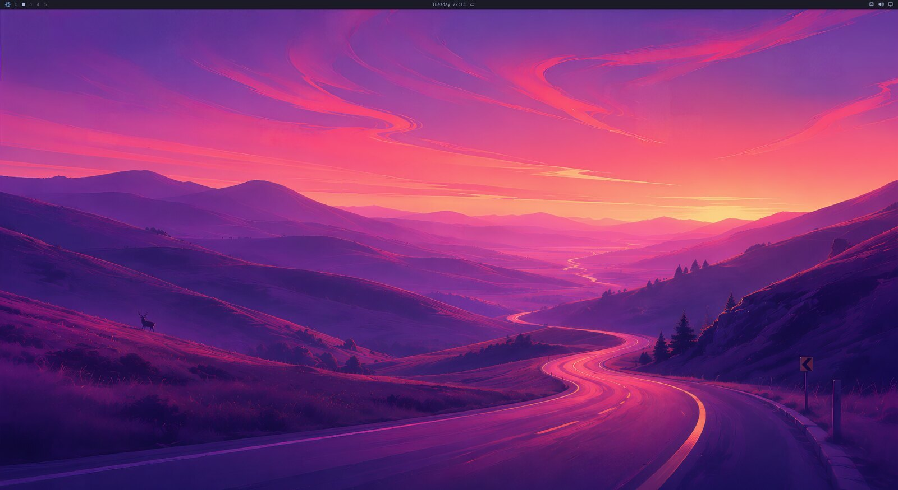
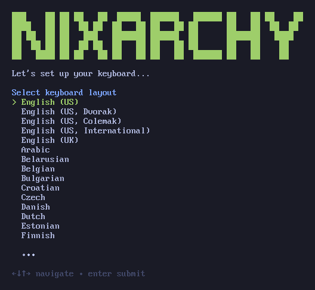
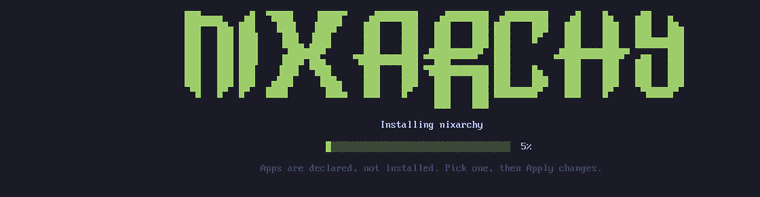
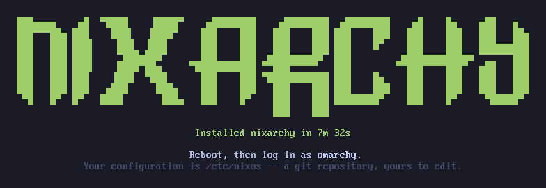

# nixarchy

[Omarchy](https://omarchy.org) vendored for NixOS — the whole desktop, with its
menus rewired to Nix instead of pacman.

Omarchy 4.x is not a dotfiles repo, it's an application: **429 shell commands**,
a QuickShell desktop shell, 22 themes, and Hyprland configured through the Lua
API introduced in 0.55. Nixarchy packages that tree as a derivation and replaces
the parts that assume Arch, rather than reimplementing it in Nix.

Tracking an upstream release is a source bump, not a re-port.

What that buys you: the Install menu writes to a Nix config instead of running
pacman, **56 applications** are selectable that way, **every other package and
NixOS option is one `Install ▸ Search` away**, plugins and themes still install
from a git URL at runtime the way upstream intends, and every command that
assumed `/usr` either points at what NixOS uses or says why it cannot.


*Login through the branded greeter, the Omarchy menu, four themes, an app
selected and applied, and a third-party plugin installed from a git URL into
the running bar — captured from a real VM by `nix build .#demo`.*



| the menu | Install |
|---|---|
|  |  |
| **Remove** | **Update** |
|  |  |
|  |  |

More in [`docs/screenshots/`](docs/screenshots).

## What works

| | |
|---|---|
| Hyprland session, QuickShell bar, 22 themes | as upstream ships them |
| `omarchy` CLI | all 429 subcommands, `omarchy commands --check` green |
| **Install menu** | picks write to a Nix config, not pacman |
| **Install ▸ Search** | one picker over 137k rows — every nixpkgs package, every NixOS option, and the app selection |
| **`nixarchy` command** | this port's own commands, and a way through to Omarchy's 431 |
| **Remove menu** | deselects apps, never touches your own config |
| **Update menu** | `nh os switch --update <flake>` |
| 56 apps in the selection | 41 from nixpkgs, 5 as NixOS modules, 8 built here, 2 with no equivalent |
| Learn menu | NixOS wiki, `search.nixos.org` packages and options |
| Shell functions | bash and zsh source the chain; fish derives it from the same files |
| RetroArch | 13 libretro cores, resolved from the store rather than `/usr/lib` |
| **Plugins** | `omarchy plugin add <url>` works as upstream ships it, and `programs.nixarchy.plugins` pins one in your flake |
| **Themes** | `omarchy theme install <url>` clones and applies a published theme at runtime |
| 13 language toolchains | Go, Rust, Node, Bun, Deno, Java, Elixir, Zig, Clojure, Scala, .NET, OCaml, Python — from nixpkgs, not from `mise` |
| Branded boot splash | Omarchy's Plymouth theme, selected by `boot.plymouth.theme` |
| **Agent skills** | `nixarchy`, `nixos` and `diagnose-crash` — rewritten for NixOS, not Omarchy's Arch originals |
| **LocalSend** | the firewall opens 53317 as upstream's `firewall.sh` does — Share ▸ Receive is reachable, not merely listening |
| Disk Usage, screensaver | `dua` and `ttfx` are runtime dependencies, so the launcher row and `SUPER + Esc` do something |
| Lock screen on sleep/wake | quickshell pinned to 0.3.1; 0.3.0 aborts on DPMS and leaves the compositor locked with no way in |

## Two names, on purpose

The desktop is Omarchy's. The port is nixarchy's. The commands say which is
which, and `nixarchy` is the way in:

```sh
nixarchy                     # what this port adds, and what it defers to
nixarchy search tailscale    # nixarchy-search
nixarchy pkg add ripgrep     # nixarchy-pkg-add
nixarchy apply               # nixarchy-apply
nixarchy theme set catppuccin   # → omarchy theme set catppuccin, unchanged
```

Anything `nixarchy` does not own it `exec`s through to `omarchy`, so both names
work and the exit status, terminal and signals stay the command's own.

**Upstream's 431 commands keep upstream's name, deliberately.** `omarchy theme
set` is the same script here as on Arch — a bug in it is a bug to report there,
and renaming it would say otherwise. It would also cost the property this repo
is built on: tracking a release is a source bump because nixarchy replaces 19
scripts and patches ~100 strings, and renaming would make all 5,365 occurrences
of `omarchy` a patch to re-apply on every bump. `omarchy.*` is also a reserved
plugin namespace that `omarchy plugin validate` enforces and third-party
plugins target.

The branding you *do* see is nixarchy's: the session is **Nixarchy**, the menu
button wears the snowflake, and the screensaver and About window carry the
NIXARCHY banner. The session's id stays `omarchy` so a greeter that already
remembers it keeps remembering it — `Name=` is what a greeter prints, the
basename is what it stores.

## Why vendoring

Everything upstream resolves through a single environment variable:

```lua
-- default/hypr/bootstrap.lua
package.path = home.."/.local/state/?.lua;"..home.."/.config/?.lua;"
  ..(os.getenv("OMARCHY_PATH") or "/usr/share/omarchy").."/?.lua;"
```

Point `OMARCHY_PATH` at a store path and the bins, the QML shell, the themes and
the Lua defaults all follow. Only **24 of 431 scripts** actually run
`pacman`/`yay` — that's the entire distro-coupling surface.

Ten of those are replaced outright, in `pkgs/omarchy/nix-bin/`: the ones the
menus drive. The rest manage Arch release channels, keyrings and orphan
pruning, none of which have a Nix meaning worth reimplementing — your flake
input *is* the release channel, and the store has no orphans. Those fail either
way, so a `pacman` shim only changes *how*: instead of `command not found`, you
get told what replaced the command. It keeps pacman's contract (stderr,
non-zero), so `omarchy version` and `omarchy debug`, which already wrap it in
`2>/dev/null || fallback`, are unaffected.

## AI agent skills

Omarchy ships skills for coding agents, and `omarchy-provision-user` symlinks every
one of them into `~/.claude/skills`, `~/.agents/skills`, `~/.codex/skills` and
`~/.pi/agent/skills`. Whatever is in that directory is what an agent on this machine
is told to do.

Upstream's are written for Arch. They point at `/usr/share/omarchy`, and their
decision framework answers "install a package" with `omarchy pkg add` — a script
this repo replaced with one that deliberately refuses. Shipping them unchanged means
an agent confidently doing imperative things the next rebuild wipes, which is the
one failure mode that looks like success.

So three skills ship here instead:

| skill | owns |
|---|---|
| **`nixarchy`** | The desktop: Hyprland, the bar, themes, capture. Upstream's `omarchy` skill, renamed and corrected |
| **`nixos`** | Packages and system changes: `apps.nix`, the Install menu, `nixos-rebuild`, generations, rollback, option search. New — upstream has no equivalent because it does not need one |
| **`diagnose-crash`** | Upstream's, patched. Keeps its name because `omarchy-agent-crash` reads that path literally |

The split is the point. `nixarchy`'s decision framework used to answer "is it a
package install?" with a pacman command; now it hands off to `nixos`, which opens
with the only rule that matters — **a package installed imperatively does not
survive the next rebuild** — and routes to `nixarchy-app-enable`, a flake edit, or
`nix shell` depending on which is actually being asked for.

`diagnose-crash` gets three corrections that are not cosmetic: there is no public
debuginfod serving nixpkgs builds, so it explains `nixseparatedebuginfod` instead
of pointing at Arch's server; "recent package updates" becomes
`nix profile diff-closures`, which names exactly what changed between generations;
and a bug report now has two possible destinations rather than one.

The `nixarchy` skill also carries two things an agent gets wrong by default here.
That a rebuild does **not** update a running session, so a fix that looks like it
failed may simply not have been loaded yet -- and specifically not to verify one
by running the script at its absolute installed path, because that path works
while the keybinding still does not, which is the most misleading result
available. And that `~/.config/omarchy/extensions/omarchy-menu.jsonc` is the one
file under `~/.config/omarchy/` that cannot be edited: it is generated, carries
the rewrite pointing every `install.*` row at the Nix selection, and replacing
the symlink with a real file silently stops the menu tracking the package.

Only `SKILL.md` and `contributing.md` are replaced outright — their guidance is
wrong here, not merely misspelt. Everything else is patched with `--replace-fail`,
so an Omarchy bump that rewords a line this depends on fails the build rather than
quietly restoring Arch instructions. CI additionally asserts that no skill code
block contains a pacman, yay, `/usr/share/omarchy` or Arch-debuginfod line, because
prose may contrast with Arch on purpose but a fenced block is what an agent copies.

## Installing apps

Omarchy's Install menu runs `pacman -S`. Here it edits a file you own.

Every app Omarchy offers is written to `~/.config/nixarchy/apps.nix` at first
login, fully populated and **entirely commented out**:

```nix
{
  programs.nixarchy.apps = {
    # ── Browser ───────────────────────────
    # brave.enable      = true;  #@ brave
    # firefox.enable    = true;  #@ firefox    # a NixOS module, so policies are declarative too
    # ── Service ───────────────────────────
    # tailscale.enable  = true;  #@ tailscale  # a daemon
    # _1password.enable = true;  #@ _1password # unfree — needs the module for its setuid helper
  };
}
```

Picking an app from the menu uncomments one line and tells you so. Pick as many
as you like — **nothing is built until you apply**, which is the point of a
declarative system:

```
Install ▸ Brave          →  "brave queued — not installed yet"
Install ▸ VSCode         →  "2 app(s) selected"
Install ▸ Apply changes  →  nh os switch <flake>
```

The notification is clickable and runs the rebuild.

### Anything the menu does not offer

The 56 apps are the ones Omarchy's own menu lists. Everything else in nixpkgs —
and every NixOS option — is behind **`Install ▸ Search`**, or `nixarchy-search`
from a terminal:

```
  nixarchy > tailscale
  ┌──────────────────────────────────────────┬──────────────────────────────────┐
  │ app  tailscale    Tailscale (Service)    │ NIXOS OPTION                     │
  │ pkg  tailscale    Node agent for Tails…  │ services.tailscale.enable        │
  │ opt  services.tailscale.enable           │                                  │
  │ opt  services.tailscale.useRoutingFea…   │ type:     boolean                │
  │ opt  services.tailscale.authKeyFile      │ default:  false                  │
  │ …                                        │ example:  true                   │
  │                                          │                                  │
  │                                          │ Whether to enable Tailscale      │
  │                                          │ client daemon.                   │
  │                                          │                                  │
  │                                          │ declared in:                     │
  │                                          │   nixos/modules/services/…       │
  └──────────────────────────────────────────┴──────────────────────────────────┘
  enter to select · tab for several · esc to cancel
```

**137,599 rows: 25,102 NixOS options, 112,443 packages, and 54 of the 56 apps
(the two with no nixpkgs equivalent cannot be indexed).** Three kinds,
one picker, because you should not have to know which kind you want before you
can look. They are not interchangeable and the rows say so — picking Tailscale
from the app rows gets you `services.tailscale` with its daemon; picking
`tailscale` from the package rows gets you the CLI and nothing running.

Selecting routes to whichever writer is right:

| row | what it writes |
|---|---|
| `app` | `<name>.enable = true;` in the app selection — the module, if the app needs one |
| `pkg` | an entry in `environment.systemPackages`, validated against nixpkgs first |
| `opt` | the option itself, as a line of its own |

Or by hand, if you already know the name:

```sh
nixarchy-pkg-add ripgrep fd     # refuses anything nixpkgs does not have
nixarchy-apply                  # one rebuild for these and your menu picks
```

**Options are only written where they can be written honestly.** An option's
value is arbitrary Nix — a submodule, a function, a package, a list of them — so
booleans and enums get a value picker and land uncommented, and anything more
complicated is written *commented out*, with its type, default, example,
description and declaring file as comments beside it:

```nix
  services.tailscale.enable = true;  #@opt services.tailscale.enable

  # NIXOS OPTION  services.nginx.virtualHosts
  #
  # type:     attribute set of (submodule)
  # default:  { localhost = { }; }
  #
  # Declarative vhost config
  #
  # declared in:
  #   nixos/modules/services/web-servers/nginx/default.nix
  # services.nginx.virtualHosts = ;  #@opt services.nginx.virtualHosts
```

The tool does the discovery and the placement; the expression stays yours.
Neither form can break a build — the scaffold is inert, and every edit is
reverted as a unit if `nix-instantiate` cannot parse the result.

**The index is built from this machine, not from search.nixos.org.** Its own
nixpkgs and its own options — about a minute, once per system generation, and
it buys the one property that matters: the picker cannot offer you a package
that this machine then refuses to build. The options half substitutes from
`cache.nixos.org`, so only the nixpkgs half is real work.

### Neovim, and the config you may already have

On Arch, Omarchy's Neovim setup arrives as an `omarchy-nvim` package. That
package has no published source — it is not in the basecamp org and the
repository serves binaries — but Omarchy carried the same files in-tree as
`config/nvim` until v3.0.2, and `pkgs/omarchy-nvim/` is that tree, byte for
byte, at the last revision anyone can read.

It is three files and under three kilobytes, because it is not a Neovim
distribution: it is **LazyVim**, plus what Omarchy changes about it. LazyVim
still resolves and locks its own plugins at runtime, exactly as on Arch.

Neovim itself is installed either way — it is one of the omarchy package's
runtime dependencies, as it is one of upstream's base packages. The only
question is `~/.config/nvim`, which is yours:

```nix
programs.nixarchy.neovim = "theme-only";   # the default
```

| | `theme-only` (default) | `adopt` | `off` |
|---|---|---|---|
| **no `~/.config/nvim`** — a fresh install | seed the config, link the theme | same | nothing |
| **you have one, no `theme.lua`** | add only the theme link | same | nothing |
| **you have a real `theme.lua`** | keep yours, say so | keep yours, and name what will collide | nothing |

**Nothing here ever overwrites a file you wrote,** and there is no setting that
does — an editor configuration is not this module's to replace. The seed fires
only into a directory that does not exist, because half-seeding is worse than
not seeding: LazyVim reads every `.lua` under `lua/plugins` as a plugin spec,
so dropping Omarchy's into someone else's config means their setup silently
loads two it never asked for.

The theming is one symlink:

```
~/.config/nvim/lua/plugins/theme.lua → ~/.local/state/omarchy/current/theme/neovim.lua
```

All 22 themes ship a `neovim.lua`, and that link is what reads it. It is set
only when the path is absent or already a symlink — the same rule upstream's
own migrations follow.

`adopt` adds nothing to what is written; it names the collisions instead. A
`lua/plugins/colorscheme.lua` beside the link is two LazyVim specs setting
`opts.colorscheme`, and a Home-Manager-owned `~/.config/nvim` is a tree the
link cannot be written into at all. Both work alone and disagree together,
which is the kind of thing worth being told once rather than debugging.

### Naming the user who runs the desktop

```nix
programs.nixarchy.user = "alice";
```

Optional, and worth setting. A NixOS machine has many users and the module
cannot guess which one logs into Omarchy, so the few things that need a name
are skipped rather than applied to someone arbitrary. Today that is the
**`input` group** — upstream's installer runs `usermod -aG input`, and without
it the dictation tools and game controllers Omarchy offers cannot read their
devices.

`browserThemeUser` is deliberately *not* defaulted from it: naming the desktop
user should not silently hand them the browsers' policy directories.

### The boot splash and the login screen

Two different screens, with two very different answers.

**The boot splash** is Omarchy's by default, and yields to anything that names
a theme of its own — stylix does, so a stylix machine keeps the stylix splash.
To take Omarchy's instead:

```nix
programs.nixarchy.bootSplash = "force";
```

`force` moves `boot.plymouth.theme` **and** `themePackages` together. Reaching
for `lib.mkForce` on the theme alone does not work: NixOS asserts the named
theme exists in the package list, and on a stylix machine stylix still owns
that list, so the build fails on a theme it cannot find. `"off"` leaves
`boot.plymouth` alone entirely.

**The login screen is SDDM-only, and this is a real limitation.** Omarchy's
greeter is an SDDM theme — `Main.qml` plus assets, written against SDDM's own
`userModel` and `login()` API. It is not a program greetd can run, and upstream
ships nothing for greetd. So:

- **On SDDM** you get it automatically. `programs.nixarchy.displayManager` is
  on by default and sets `services.displayManager.sddm.theme = "omarchy"`,
  branded with the NIXARCHY wordmark.
- **On greetd** you cannot have that screen. Your greeter keeps greeting and
  picks up the Omarchy session like any other — which is what
  `programs.nixarchy.displayManager = false` is for. Switching to SDDM to get
  it means giving up greetd, and two display managers is not a working
  configuration.

There is no third option today. Porting the QML to a greetd greeter would mean
rewriting it against a different login API, which is a fork of upstream's
greeter rather than a setting.

### Apps you already have

The Install menu dims a row when the app is already there — whether it is in
your selection, or you installed it yourself and nixarchy knows nothing about
it. That second case is the one worth naming: an app in your own
`environment.systemPackages` or `home.packages` used to be offered as though
you had nothing, and taking the offer wrote a second declaration for something
you already run.

`nix run github:olafkfreund/nixarchy#doctor` reports the overlap before you
install anything:

```
Omarchy apps you already have
  15 of them, and nixarchy will not install a second copy:
    Alacritty
    Chrome
    Firefox
    ...
```

Both the report and the menu look for the same thing — the app's command on
PATH — so what the doctor lists and what the menu dims agree. The command comes
from nixpkgs' own `meta.mainProgram`, read at evaluation time without building
anything, because the attribute name is wrong often enough to matter: `vscode`
puts `code` on PATH and `obs-studio` puts `obs`.

**Remove rows deliberately do not work this way.** They stay bound to the
selection, because deselecting is the only removal nixarchy is allowed to
perform. An app that arrived from your own configuration is not this menu's to
take away.

### The selection has to be imported

`nixarchy-apply` copies `~/.config/nixarchy/apps.nix` to your flake root as
`nixarchy-apps.nix`. A flake cannot read a file outside its own tree, so the
copy is unavoidable — but **importing it is yours to do**:

```nix
imports = [ ./nixarchy-apps.nix ];   # path relative to the file you add it to
```

Without that line the menu marks apps enabled, apply reports a copy, the
rebuild runs to completion, and **nothing is ever installed**. `apply` now says
so loudly rather than leaving you to work it out from an app that never
appears.

### Why it isn't a package list

Several of these are **not packages** on NixOS, and a flat `systemPackages`
list would have been quietly wrong:

| app | what it actually needs |
|---|---|
| Steam | `programs.steam` — an FHS wrapper, or it will not run |
| 1Password | `programs._1password-gui` — a setuid helper, or it cannot unlock |
| Tailscale | `services.tailscale` — a daemon |
| Xbox controllers | `hardware.xpadneo` — a kernel driver |
| Firefox | `programs.firefox` — so policies and extensions stay declarative |

`data/apps.nix` records which is which, and per-app `settings` merge at that
app's own option path:

```nix
programs.nixarchy.apps.tailscale = {
  enable = true;
  settings.useRoutingFeatures = "client";   # → services.tailscale.useRoutingFeatures
};
```

## Usage

```nix
{
  inputs.nixarchy.url = "github:olafkfreund/nixarchy/v4.0.1-1";

  outputs = { nixpkgs, nixarchy, ... }: {
    nixosConfigurations.mymachine = nixpkgs.lib.nixosSystem {
      modules = [
        nixarchy.nixosModules.nixarchy
        {
          programs.nixarchy.enable = true;
          # Where nixarchy-apply copies your app selection before rebuilding.
          programs.nixarchy.flake = "/home/you/nixos-config";
        }
        ./nixarchy-apps.nix # the generated selection
      ];
    };
  };
}
```

And in Home Manager:

```nix
{
  imports = [ nixarchy.homeManagerModules.nixarchy ];
  programs.nixarchy.enable = true;
  programs.nixarchy.defaultTheme = "tokyo-night";
}
```

### Shell functions

Omarchy's [shell functions](https://omarchy.org/manual/shell-functions/) —
`compress`, `dip`, `hdl`, `tdl`, `iso2sd`, the tmux and git-worktree helpers,
20 in all — come from a bash rc chain that also sets aliases and `EDITOR`. It
needs no patching here: every path in it resolves through `OMARCHY_PATH`.

It is on by default, and opinionated: it aliases `ls` to eza, `cd` to zoxide
and `g` to git. Turn it off if you bring your own shell config:

```nix
programs.nixarchy.bashIntegration = false;
```

Left on, it loads from `/etc/bashrc` — *before* `~/.bashrc` — so anything you
define yourself still wins. Nothing in the desktop depends on it: the menus
call the `omarchy-*` executables directly, not these functions.

### Plugins

[Omarchy's plugin system](https://omarchy.org/manual/plugins/) works here
unchanged — the menu below is upstream's own, running on NixOS:


Two published third-party plugins, installed into that session and then turned
off again. The top bar is the same bar in both strips — the teleprompter glyph
beside the clock and the widget-toggle icon on the right are
[omteleprompt](https://github.com/seyhunak/omteleprompt) and
[omarchy-bar-toggle](https://github.com/r3mcos3/omarchy-bar-toggle):


Both frames come out of `checks.plugin`, which installs those two plugins from
their real repositories on every push and fails if the shell does not load
them. Adding one is a command, not a rebuild:

```bash
omarchy plugin add https://github.com/seyhunak/omteleprompt.git --enable
```

Or from the menu above, which is where most people will find it. Add opens a
floating terminal and asks for the URL. Those rows are upstream's own — nixarchy
adds none and, more to the point, takes none away: the menu you see is Omarchy's default with the
nixarchy extension merged over it by id, and that extension rewrites only the
`install.*` and `remove.*` rows. The check asserts it never names a
`setup.plugin.*` id, because an override that did would hide the row with no
error anywhere.

That clones into `~/.config/omarchy/plugins/` at runtime and the running shell
picks it up — no rebuild, no flake edit, nothing added to `apps.nix`. It is
upstream's design and nixarchy keeps it: a plugin is somebody's QML loaded into
your bar, and pinning that in a flake would make trying one a five-minute
round trip instead of a command.

Two things make it work on NixOS that would otherwise be quiet failures, and
both are covered by `nix build .#checks.x86_64-linux.plugin`, which installs two
real published plugins and then removes them again:

- **`~/.config/omarchy` is a real directory, not a store symlink.** Home Manager's
  usual answer for a config file is a read-only link into `/nix/store`. The seed
  uses `cp -rn` instead, so `plugin add` can write there at all.
- **A plugin gets whatever `pkgs/omarchy/default.nix` declares, and nothing else.**
  Plugins shell out to commands they assume are present — omteleprompt's voice
  mode runs `python3`, `parecord` and `arecord`. On Arch those are just there.
  Here they are on the list, and the check keeps them there. A plugin needing
  something that isn't will fail silently inside a QML `Process`, so if one
  misbehaves, that is the first thing to look at.

#### Declaring plugins in your configuration

Plugins can also be pinned, so a machine rebuilt from your flake comes up with
them already there:

```nix
programs.nixarchy.plugins.omteleprompt.src = pkgs.fetchgit {
  url = "https://github.com/seyhunak/omteleprompt.git";
  rev = "9a35865220a0c9d65132329e446a84c466545110";
  hash = "sha256-KJM/AC1DnPwob40lo39Rlk9qkyKTI++bss1wPIcGsTs=";
};
```

`src` is any directory with a `manifest.json` at its root — a `fetchgit`, a
flake input, or a path in your own repo while you write one.

This works because upstream already separates the two halves: a plugin's *code*
lives in `~/.config/omarchy/plugins/<id>/`, while whether it is enabled and
where it sits in the bar are recorded in `~/.config/omarchy/shell.json` by the
running shell. So the code can come from the store — the directory is a symlink,
which upstream's scan follows and `omarchy plugin remove` has an explicit branch
for — without freezing anything the user changes at runtime.

Three consequences worth knowing, all of them deliberate:

- **It installs a plugin; it does not enable one.** Enable it once from
  Setup → Plugins and that choice sticks, because it is recorded in
  `shell.json` rather than in the plugin folder. Managing enablement from Nix
  would mean a plugin you turned off came back at the next rebuild.
- **The id comes from the plugin's own `manifest.json`**, not from the
  attribute name. It is what the shell, the menu and every `omarchy-plugin-*`
  command key on, so a folder named anything else would be a plugin you could
  not enable or remove by the name on screen.
- **A broken manifest fails the rebuild**, checked with upstream's own
  `omarchy-plugin-validate` rather than a copy of its rules — so it cannot
  drift at the next Omarchy bump. You find out at `nixos-rebuild` instead of
  after logging in to a plugin that installed and does nothing.

`omarchy plugin add` still works alongside this, and the two do not collide: a
plugin you add by hand is a real directory this never touches, and adding one
whose id you already declare is refused rather than installed twice.

Plugins run unsandboxed inside your long-lived shell process. Upstream warns
about this at the prompt and refuses `ext::`-style URLs that would run a command
at clone time; both behaviours are intact here.

### RetroArch cores

`pkgs.retroarch` is `retroarch-with-cores` built with an **empty** core list,
so installing it plainly gives an emulator that can run nothing.
`programs.nixarchy.apps.retroarch` therefore ships its own build with 13 cores
— every core Omarchy's own picker offers that nixpkgs carries under a free
licence, with bsnes and blastem standing in for the unfree snes9x and
genesis-plus-gx.

`retroarch-full` would be the obvious alternative and is the wrong one: it
pulls unfree cores, and a single unfree package in the app list aborts the
whole rebuild rather than failing on its own. nixarchy allows unfree by
default, so widening the set is just the override:

```nix
programs.nixarchy.apps.retroarch = {
  enable = true;
  package = pkgs.retroarch.withCores (c: [ c.snes9x c.mame c.dolphin ]);
};
```

Whatever you pick shows up in the menu picker: upstream filtered the core
directory against 22 hardcoded names, which would have hidden anything you
added, so nixarchy lists what is actually installed and takes the labels from
`libretro-core-info`.

## Binary cache

Enabling nixarchy otherwise means compiling a compositor, because it pins
Hyprland ahead of nixpkgs. The module adds both caches for you:

```
https://nixarchy.cachix.org   the vendored tree, this flake's own packages,
                              and Hyprland at whatever commit is pinned
https://hyprland.cachix.org   hyprwm's own builds
```

`programs.nixarchy.binaryCaches = false` if you would rather trust neither and
build from source. This is the one setting worth a deliberate decision:
substituters are a list, so they merge into whatever you already trust without
any conflict to warn you.

## Installing on a fresh machine

There is an ISO now. Build it, write it to a stick, boot it, and answer nine
questions.

```
nix build github:olafkfreund/nixarchy#iso
sudo dd if=result/iso/nixarchy-*.iso of=/dev/sdX bs=4M status=progress oflag=sync
```

No boot menu, no login prompt: the installer is what comes up.



Keyboard, then your account, then the disk — [step by step in the
manual](https://olafkfreund.github.io/nixarchy/manual/getting-started). Encryption is on unless you press
Ctrl+C at the overwrite warning, and one password serves your user, root and the
disk alike.

Then it gets out of the way. The log goes to `/var/log/nixarchy-install.log`
rather than the screen, because a wall of store paths tells nobody anything they
can act on.



*The whole install, four minutes at four-second intervals.*



Reboot and you are at the desktop. An encrypted install goes straight there —
the passphrase you typed at boot already proved who you are, so there is no
second password.

**What you get is a flake you own.** `/etc/nixos` is a git repository holding a
`flake.nix`, a `configuration.nix`, the disk layout that formatted the disk, and
your app selection. Edit it and run `nh os switch`. Nothing the installer did is
hidden from that directory, which is the point: a rebuild immediately after
install builds nothing, because everything it did is described there.

**Three caveats worth knowing before you write the stick.**

The image **needs a network**: it downloads the closure rather than carrying it,
so an install is as fast as your connection. Making it offline is the next phase
of the work.

It is **UEFI only** — the layout is an ESP with systemd-boot, and there is no
BIOS path.

And if you encrypt, **the passphrase prompt at boot comes before Bluetooth
exists**. A wireless keyboard that pairs after the desktop is up cannot type
into the initrd, so the machine sits there waiting for a key you have no way to
press. Upstream's manual carries the same warning because people hit it. Use a
wired keyboard for the first boot, or do not encrypt.

## Adding it to a machine you already run

Start here:

```sh
nix run github:olafkfreund/nixarchy#doctor
```

It reads the running system and prints the configuration that machine needs --
before nixarchy is an input anywhere. It changes nothing.

Two of the things it reports are worth knowing about in advance, because both
fail *silently* rather than loudly:

**Your session may be running an older build than the one installed.**
`OMARCHY_PATH` and `PATH` are set at login and keep pointing at whichever store
path was current then. A `nixos-rebuild switch` installs a new package at a new
path and cannot change the environment of a session already running, so every
`omarchy-*` command the desktop executes -- every keybinding, every menu row --
comes from the old build until you log out and back in. The doctor compares the
two and says so. On Arch this cannot happen: the tree lives at a fixed
`/usr/share/omarchy` overwritten in place, and a running session picks up a new
version at once. Here the path itself changes.

**`Setup > Default browser` may report success and change nothing.** If
`mimeapps.list` is a store symlink -- which is what `xdg.mimeApps` in Home
Manager produces, and the right way to declare it -- `xdg-settings` fails on the
read-only file and *still exits 0*. `omarchy-default-browser`'s `|| exit 1` never
fires. Nothing is broken and nothing says so, which is the only reason it is
worth a section: the fix lives in a file the menu cannot reach.

Then, in order:

1. **Add the input**, and import the NixOS module. Pin a release unless you
   want `main` moving under you -- see [Releases](#releases) for what the
   version means.

   ```nix
   inputs.nixarchy.url = "github:olafkfreund/nixarchy/v4.0.1-1";
   # in your host's modules:
   imports = [ inputs.nixarchy.nixosModules.nixarchy ];
   programs.nixarchy.enable = true;
   ```

2. **Paste what the doctor printed.** On a machine that already runs Hyprland
   behind greetd, that is:

   ```nix
   programs.nixarchy.displayManager = false;                        # keep your greeter
   programs.hyprland.package = lib.mkForce pkgs.hyprland;           # keep your Hyprland
   programs.hyprland.portalPackage = lib.mkForce pkgs.xdg-desktop-portal-hyprland;
   ```

3. **Import the Home Manager module** for the user who will run the desktop.
   Without it there is no app selection, no theme state and no seeded config.

   ```nix
   home-manager.users.you = {
     imports = [ inputs.nixarchy.homeManagerModules.nixarchy ];
     programs.nixarchy.enable = true;
   };
   ```

4. **Rebuild.** `nixos-rebuild switch` will tell you about anything the doctor
   missed: every remaining conflict is an evaluation failure, not a broken
   machine.

5. **Log out and pick "Omarchy"** at your greeter. If you already have a
   Hyprland config, this is the step that matters -- see below.

### After it is installed

```sh
nix run github:olafkfreund/nixarchy#verify
```

From inside a running Omarchy session. Everything this repo checks in CI runs
in a machine with no GPU, no Bluetooth radio, no network and no sound -- which
catches a great deal and cannot answer whether the compositor got hardware
acceleration, whether bluetoothd sees an adapter, or whether the RetroArch
cores landed where RetroArch looks. This asks those, and prints what it found
rather than a verdict: `llvmpipe` and `AMD Radeon` are both a pass to a script
and mean opposite things to a person.

On a laptop with hybrid graphics it reads:

```
Session    ✓ Omarchy shell running        pid 2019165
Graphics   ✓ hardware rendering
             Mesa Intel(R) UHD Graphics (CML GT2)
             Intel CometLake-H GT2 [UHD Graphics]
             NVIDIA GA104M [GeForce RTX 3080 Mobile / Max-Q 8GB/16GB]
Bluetooth  ✓ bluetoothd sees 1 adapter(s)
Theme      ✓ portal reports dark          ✓ cursor follows the theme
Shell      ✓ functions wired in           ✓ compose sequences resolve

16 passed, 0 failed, 3 worth a look
```

It distinguishes **absent from broken**: on a machine that has never installed
Omarchy the checks that need it report as notes, not failures, and the header
names the desktop that *is* running.

### What running it on real hardware found

Nine defects, none of which any VM check could have caught. Six were in this
repo, and three were in the checks themselves -- tests that passed for
structural reasons rather than because anything was right:

| | |
|---|---|
| `start-hyprland` | the session exec'd the Hyprland binary directly, and 0.56 logs a warning asking to be supervised by its watchdog |
| `OMARCHY_PATH` | all three shell rc files fell back to `/usr/share/omarchy` when the variable was unset — a path that can never exist here, so a systemd unit or container sourcing one got no aliases at all. They locate themselves now |
| the app selection | copied into the flake and imported by nobody: apps looked enabled and were never built. `apply` says so now |
| Vulkan | looked in `/usr/share/vulkan/icd.d`, which NixOS does not use — it reported no Vulkan on every machine |
| both app launchers | tested `-x /usr/bin/<app>`, never true here, so clicking Spotify offered to *install* Spotify |
| the boot splash | Omarchy's Plymouth theme was never installed, so the one screen every boot shows was unbranded |
| **the graphics check** | reported "hardware rendering" on any machine, llvmpipe included: it matched a header containing no renderer, so the software-rendering case could never fire |
| **the shell check** | `pgrep -x quickshell` cannot match `.quickshell-wrapped`, so it reported the bar missing while it was on screen |
| **the functions check** | `type tdl` from a script cannot see a parent shell's functions — it was incapable of passing, for every shell |

The last three are the reason this section exists. A check that cannot fail
looks exactly like a check that passes.

### If you already have a `~/.config/hypr/hyprland.lua`

Nothing is overwritten, and you keep both desktops. The seed never replaces a
file you own, so Omarchy's own `hyprland.lua` is not installed — and it does not
need to be. The **Omarchy** session entry runs Hyprland with `--config` against
Omarchy's copy in the store, so your Hyprland session stays exactly yours and
Omarchy's is Omarchy's. Pick whichever at the greeter.

You will see one line on rebuild saying so. The only case that warns is
`programs.nixarchy.session = false` *and* a Home Manager-owned `hypr/` — with
no session entry and no installed config, that configuration has Omarchy's
applications and menus but no way to reach its desktop.


Nixarchy never overwrites a file you own, so Omarchy's own `hyprland.lua` is
not installed and nothing in `~/.config/hypr` starts its bar or binds its keys.

The **Omarchy** session is the answer, and it is registered by default. It runs
Hyprland against Omarchy's own config with `--config`, so it needs no file of
yours: your session stays yours, and Omarchy's is Omarchy's. `nix build
.#checks.x86_64-linux.coexist` boots exactly that arrangement -- a foreign
`hyprland.lua` in place, the Omarchy session launched from its own `.desktop`,
and the desktop asserted to render.

The two sessions share
`~/.config/hypr/{monitors,input,bindings,looknfeel,autostart}.lua`, because
Omarchy's bootstrap builds Hyprland's Lua module path from `$HOME/.config` and
nothing else. Only the entry point differs, so editing those changes both.

### What defers to you automatically

Every system service the module turns on is `mkDefault`, so your own settings
win rather than colliding. If you already run Docker your way, or
systemd-networkd instead of NetworkManager, or Plymouth off, nothing here
argues with you.

Two cases are handled rather than merely deferred:

| Your machine | What happens |
| --- | --- |
| TLP for power management | power-profiles-daemon is left off; NixOS forbids both. `omarchy powerprofiles` stops working, nothing else does |
| GDM, LightDM, greetd or ly | set `displayManager = false`; your greeter picks up the **Omarchy** entry from `wayland-sessions` and you lose only the branded greeter |
| Hyprland already configured | log in through the **Omarchy** session. It runs Hyprland against Omarchy's own `hyprland.lua` via `--config`, so it never needs `~/.config/hypr/hyprland.lua` and your session keeps working |

Two are not, because they are not nixarchy's to resolve:

- **PulseAudio.** NixOS enables PipeWire for any graphical session and asserts
  the two cannot coexist. A plain `programs.hyprland.enable = true` with
  PulseAudio fails the same way, with no nixarchy in sight.
- **Hyprland itself.** `programs.hyprland.enable`, its package and `withUWSM`
  are set outright, not with `mkDefault`. Omarchy is written against Hyprland's
  Lua API; replacing the compositor means `lib.mkForce`, which is the right
  amount of friction for that. If you already pin your own Hyprland, `mkForce`
  it -- anything from 0.55 satisfies the assertion.

The two sessions do share `~/.config/hypr/{monitors,input,bindings,looknfeel,
autostart}.lua`, because Omarchy's bootstrap builds Hyprland's Lua module path
from `$HOME/.config` and nothing else. Only the entry point differs.

## Try it in a VM

```sh
# graphical -- this is the one that shows the desktop
QEMU_OPTS="-device virtio-vga-gl -display gtk,gl=on" \
  nix run github:olafkfreund/nixarchy#vm

# headless -- serial console, for reading the journal when the session is broken
QEMU_OPTS="-display none -serial mon:stdio" \
  nix run github:olafkfreund/nixarchy#vm
```

Autologs in as `omarchy` / `omarchy`, with sshd on `localhost:2222` so the VM
can be inspected and driven from the host.

**The VM's disk is ephemeral.** `nix run .#vm` otherwise writes a
`nixarchy-vm.qcow2` and reuses it forever, which makes a smoke test replay the
previous run's state — Omarchy persists every notification under
`~/.local/state/omarchy/notifications/history/` and replays it on start, so
fixed bugs kept reappearing from a stale disk.

## Screenshots and the screencast

`nix build .#demo` boots a machine, logs in through the greeter, drives a tour
of it and writes the frames plus an mp4 and a GIF:

```sh
nix build .#demo
ls result/screenshots/          # every step, numbered
cp result/nixarchy-demo.gif docs/nixarchy-demo.gif
```

It needs no display and no SSH, because the frames come from qemu's own
screendump rather than a compositor screencopy -- `grim` cannot help here, as
nothing consumes the frames and it blocks forever.

`docs/capture-screenshots.sh` is the older path and still captures menus the
tour does not visit. It has to run against a **graphical** VM, for that same
reason:

```sh
ssh -p 2222 omarchy@localhost 'bash -s' < docs/capture-screenshots.sh
scp -P 2222 'omarchy@localhost:~/nixarchy-screenshots/*.png' /tmp/shots/
# they are photographic, so the repo keeps them as jpg
for f in /tmp/shots/*.png; do
  magick "$f" -resize 1600x -quality 86 "docs/screenshots/$(basename "${f%.png}").jpg"
done
```

## Staying current with Omarchy

Almost nothing here waits on a maintainer.

**46 of the 56 apps never touch this repo.** Brave, VSCode, Signal and the rest
are installed as `pkgs.<name>` from **your** nixpkgs, and the five
module-backed ones (Steam, 1Password, Tailscale, Firefox, Xbox controllers)
come from there too — the module is NixOS', not this repo's. Your own
`nix flake update` moves all of them. Nixarchy is not in that path, so there
is nobody to wait for.

**Omarchy itself is checked daily.** `omarchy.yml` asks GitHub for the newest
release, and if it differs from the pin it bumps the input and re-runs every
assertion against the new tree:

```
v4.0.0 -> v4.0.1
  ✓ the vendored tree builds
  ✓ every bin this port replaces is still there
  ✓ every substituteInPlace anchor still matches   (--replace-fail)
  ✓ every menu row it overrides still exists
  ✓ all 37 Install rows are still mapped in data/apps.nix
  ✓ a booted session renders its wallpaper   (delta 10, threshold 120)
```

Each line is a different way upstream can break this port, and each has caught
a real one. The last is the reason the others are not enough on their own: the
desktop once rendered pure black while every other check passed — a wallpaper
wider than `GL_MAX_TEXTURE_SIZE` draws nothing at all while Qt still reports
the image `Ready`. So the session test boots a machine, screenshots it through
qemu, and compares the screen's average colour to the wallpaper's own.

If they all pass, the bump merges itself. When one fails, the run summary
names which of them broke and which file to edit. **A new app in Omarchy's Install menu is usually one line** in
`data/apps.nix` — `attr` for a plain nixpkgs package, `option` for something
that needs a NixOS module. The menu rewiring and its Remove row are generated
from that entry.

## Keeping applications updated

Most of it is not our job, and should not be:

| where the app comes from | who updates it |
|---|---|
| nixpkgs (46 of 56 apps) | **nobody** — your own `nix flake update` |
| pinned in this repo (2) | a weekly bot, opening a PR |
| `zen` | upstream's own flake |
| `retroarch` | nixpkgs, via this flake's own pin — it is a rebuild with cores |

For the handful pinned here by version and hash, `.github/workflows/update.yml`
runs `nix run .#update` weekly, builds everything it changed, and opens a
PR. Those PRs are **not** auto-merged: a build proves a package assembles, not
that it still launches, and two of them are proprietary Electron bundles that
can do the first without the second.

Every app also exposes a `package` option, so a newer version is yours to take
without a fork or a PR:

```nix
programs.nixarchy.apps.once.package =
  nixarchy.packages.${system}.once.overrideAttrs (old: rec {
    version = "0.4.0";
    src = pkgs.fetchurl {
      url = "…";
      sha256 = "…";
    };
  });
```

## Design notes

Each of these is a bug that shipped, was found, and is now guarded by CI.

### The menu is data, and overrides destroy what they omit

Upstream reads one extension file and merges it over the defaults by id. Its
comment says you can *"tweak label/icon/action without re-declaring the whole
row"*. **The code does not do that:**

```js
label: value.label || id,                    // normalizeItem runs on the override too
icon:  value.icon  || "",
for (var k2 in entry) merged[k2] = entry[k2] // then copies ALL keys over the default
```

An override that omits a key does not inherit upstream's — it blanks it.
Omitting `label` renders the raw id (`install.editor.vscode` instead of
`VSCode`); omitting `action` makes the row do nothing when clicked. The menu
extension is therefore **generated by reading Omarchy's own menu** and carrying
every unstated key across, so labels can never drift from upstream's. CI
rejects a row with no label or no action.

The 16 per-app Remove rows are derived the same way: upstream names the app
only inside its `when`, as `omarchy-pkg-present <arch-package>`, so the
generator reads that and rewrites the row.

### Bins are symlinked, not wrapped

`bin/omarchy` discovers its subcommands by grepping the first 80 lines of each
sibling for `# omarchy:summary=`. A `wrapProgram`-generated wrapper has no such
comment, so wrapping every bin makes the CLI report **zero** commands while
still building fine. Runtime dependencies reach the scripts through the
module's `systemPackages` instead.

### Wallpapers are capped at 4096px

Omarchy ships wallpapers up to 7680px wide, and 5 of the 8 in the default theme
exceed 4096 — `GL_MAX_TEXTURE_SIZE` on llvmpipe and on plenty of integrated
GPUs. Over that limit the image cannot become a texture and **nothing is drawn,
with no error anywhere**: Qt reports the image `Ready` at its full size, the
layer surface exists at alpha 1, and the log is clean. `sourceSize` caps what
Qt decodes, which fixes it on every machine with that limit.

### GL apps need a software fallback in a VM

Three separate symptoms turned out to be one cause: kitty and LocalSend died
on startup with `EGL: No EGLConfigs returned`, and opening the menu blanked
the whole desktop, bar included. The scrim was not at fault — dropping its
alpha from 0.5 to 0.12 changed the rendered pixel not at all.

qemu's virgl path hands out no usable EGL config, so every GL consumer fails:
the apps refuse to start, and Hyprland composites nothing beneath its overlay
layer. The guest has `swrast`, `virtio_gpu` and a render node all the same, so
nothing looks wrong until something asks for a config.

`LIBGL_ALWAYS_SOFTWARE=1` in the VM fixes all three. With it, the menu dims
the wallpaper (`#281640` over `#36115A`) instead of erasing it. It is set for
the VM only: on a real GPU it would push every GL app onto the CPU.

### User state stays mutable

`omarchy-theme-set` applies themes at runtime by copying files into
`~/.local/state/omarchy/current/` and flipping symlinks. That's anti-Nix, and
it's also why theme switching is instant instead of a rebuild.

- **Nix owns** packages, services, hardware, `OMARCHY_PATH`, the default theme
- **Omarchy owns** `~/.local/state/omarchy` and `~/.config/omarchy` at runtime

Those are copied with `--no-preserve=mode`: `$OMARCHY_THEMES_PATH` is a store
path, so `cp -r` otherwise stages a read-only directory and the *next* theme
switch cannot clean it up.

### Hyprland comes from upstream, not nixpkgs

Omarchy 4.x needs ≥ 0.55 for `hl.bind` / `hl.window_rule` / `hl.on`; nixpkgs is
on 0.54.3.

The flake pins a **commit**, not the `v0.56.2` tag, because that tag does not
build against its own `flake.lock`: its `CMakeLists.txt` asks for
`find_package(glaze 7...<8)` while `nix/overlays.nix` feeds it the glaze 8.0.0
from its locked nixpkgs. `find_package` fails, CMake falls back to cloning glaze
over the network, and the build sandbox has none.

`inputs.nixpkgs.follows` is deliberately **not** set on it — hyprwm asks
consumers not to, and overriding forfeits their binary cache.

### quickshell is pinned ahead of nixpkgs too, but temporarily

nixpkgs ships 0.3.0, whose session lock reaches `qFatal` when screens sleep and
wake while locked:

```
FATAL: Tried to show lockscreen surfaces without active lock
```

in `WlSessionLock::updateSurfaces`. The process aborts — and because the Wayland
session-lock protocol deliberately keeps the compositor locked when its lock
client disappears, what is left is a blank screen with nothing to type a password
into. Reboot is the only way out. That is the protocol working as designed on top
of a crash.

v0.3.1 fixes it and says so: *"Fixed session lock crashes on sleep, wake, DPMS,
and unlocking."* An `overrideAttrs` rather than a fork — nixpkgs keeps the build,
the Qt wrapper and the dependency set, and only the tag moves. It is passed to
the omarchy package rather than set on the overlay, so a machine using quickshell
for something of its own still gets nixpkgs'.

Unlike the Hyprland pin, this one is meant to go away: delete it when nixpkgs
ships ≥ 0.3.1. Tracked in issue #35.

## Releases

```nix
inputs.nixarchy = {
  url = "github:olafkfreund/nixarchy/v4.0.1-1";
  inputs.nixpkgs.follows = "nixpkgs";
};
```

**The version names the Omarchy it vendors**, because that is the first thing
anyone needs to know about a packaging repo: `v4.0.1-1` is Omarchy 4.0.1. The
suffix counts packaging releases against that upstream — a fix here that does
not move Omarchy becomes `v4.0.1-2`, and Omarchy 4.0.2 becomes `v4.0.2-1`. A
plain semantic version would leave you reading the changelog to answer the
question the tag should answer on sight.

`inputs.nixpkgs.follows` is worth setting. The module takes its package from
`pkgs.extend`, so following your nixpkgs keeps Omarchy's ~80 runtime
dependencies as the store paths your system already has, rather than a second
copy built from nixarchy's own.

Tracking `main` instead is reasonable while you are trying things — it is what
the machines this is developed on do — but it moves, and the option surface has
been moving with it.

The `nix run` commands in this README are deliberately left unpinned.
`doctor`, `verify` and `vm` are one-shot and change nothing, so the newest is
the one you want; it is flake *inputs*, which decide what your system is built
from, that are worth holding still.

**There is no 1.0 yet, deliberately.** `plugins`, `preinstallsExclude` and
`bootSplash` were all added within a day of each other. 1.0 is a promise that
the options have stopped changing, and they have not; that number is worth
keeping until it means something. Until then, expect options to be added and
occasionally reshaped between releases, and read the release notes before
bumping.

## Development

```sh
nix develop                  # or `direnv allow`
nix build .#omarchy          # fast -- just the vendored tree
nix flake check              # everything, including a booted session test
nix run .#vm                 # smoke test
nix run .#update         # bump the pinned packages
```

The six checks, and what each is for:

| check | boots a VM | what it is for |
| --- | --- | --- |
| `session` | yes | the desktop itself — greeter, bar, themes, the Install loop, theme install, migrations, the `/usr` scan |
| `plugin` | yes | `omarchy plugin add` from real repos, and `programs.nixarchy.plugins` |
| `coexist` | yes | the Omarchy session beside somebody else's `hyprland.lua` |
| `integration` | no — **builds** | the module onto a configuration that already exists |
| `options` | no | every option both ways, plus menu coverage and menu commands |
| `vm-toplevel` | no | the reference machine still builds |

Only the first three boot a machine, so `nix build .#checks.x86_64-linux.options`
is the quick one to run while editing `data/apps.nix`.

## Status

Working, and each line names what proves it rather than asserting it. All but
the last run in CI on each push; the last is two machines that boot it.

| | proven by |
| --- | --- |
| The session, bar, themes and wallpaper | `checks.session` logs in through SDDM's greeter and asserts the desktop *renders* -- it compares the screen against the wallpaper, because every other check passed once while it was black |
| Installing on a blank machine | a real install from the ISO onto an empty disk: partitioned, closure copied, bootloader written, and the result booted into the desktop on its own. By hand, not in CI -- `checks.install` is written and not yet green, which is why this line says "two machines" above and not "every push" |
| Adding it to a machine you already run | `checks.integration` **builds** the module onto a config that overrides a package Omarchy also uses, pins its own Hyprland and already greets with greetd |
| Sitting beside an existing Hyprland | `checks.coexist` boots the Omarchy session with a foreign `hyprland.lua` in place and asserts the bar comes up anyway |
| The CLI | `omarchy commands --check`, plus a count the build refuses to let drift |
| The Install/Remove/Update menus | `checks.session` enables an app, applies it, and asserts the selection reached the flake |
| Third-party plugins | `checks.plugin` runs `omarchy plugin add <url> --enable` for two published plugins, then asks the *running shell* whether it loaded them -- not the filesystem -- before disabling and removing both |
| Plugins pinned in your configuration | `checks.plugin` installs one through `programs.nixarchy.plugins` as a store symlink and asserts the *shell* discovers and loads it, that `plugin add` refuses to double-install it, and that `plugin remove` unlinks it |
| Themes installed from a git URL | `checks.session` runs `omarchy theme install` against a real published theme and asserts the desktop moved to it -- name, and a wallpaper that came out of the clone |
| Nothing reaching into `/usr` | `checks.session` scans every shipped command for a `/usr` path in code, against a named list of the Arch-only ones that explain themselves |
| Every Install row mapped | `checks.options` compares upstream's menu against `data/apps.nix` both ways -- a row added upstream that nobody maps fails, and so does one that no longer exists |
| Every menu row's command existing | `checks.options` resolves all 129 `omarchy-*` commands the 323 rows name; a row whose command vanished draws normally and does nothing |
| Migrations refusing to run | `checks.session` asserts `omarchy migrate` explains itself instead of running 86 Arch scripts that sudo into `/usr` |
| The session under Hyprland's watchdog | `checks.coexist` greps the journal for the warning 0.56 logs when the compositor is exec'd directly instead of through `start-hyprland` |
| The shell rc files locating themselves | `checks.session` sources each with `OMARCHY_PATH` unset and asserts it resolves to the store, not to a `/usr` path that cannot exist |
| **Two real machines** | a workstation and a laptop, both running it beside niri, Hyprland and GNOME behind greetd. `nixarchy-verify` inside the laptop's session: 16 passed, 0 failed |
| Every desktop entry's command existing | CI derives the list from the shipped `.desktop` files rather than a hand-written one, and resolves each against the package and the runtime env — `Disk Usage` shipped launching a `dua` nothing installed |
| Every app's `attr` naming a real package | CI resolves each `data/apps.nix` entry in the overlay. The doctor falls back to the attribute name when a lookup fails, which is right by luck when the attribute matches the binary and wrong when it does not: `zen` for a package installing `zen-beta`, `hey-cli` for one installing `hey` |
| The browser lookup ignoring `$BROWSER` | CI asserts all four scripts that resolve a browser guard the call. `xdg-settings get` skips the mime database when `$BROWSER` is set and answers with the first `.desktop` whose `Exec` matches — on a Chrome user's machine, a web app rather than a browser |
| The agent skills being NixOS-aware | CI asserts the skill set, that each `SKILL.md`'s frontmatter name matches its directory, and that **no fenced code block** contains a pacman, yay, `/usr/share/omarchy` or Arch-debuginfod line. Prose may contrast with Arch deliberately; a code block is what an agent copies |
| Skill links surviving a rebuild | `checks.session` asserts all three skills are linked in all four agent homes and that each resolves to a `SKILL.md` **inside the current closure** — a stale link passes `-L` and fails `-e`, which is the case that matters |
| The shell chain in bash, zsh and fish | asserted by running each shell and calling the functions, not by checking a file exists |
| Compose keys, Bluetooth, UPower, the browser accent | asserted on the thing itself: the include resolves, the unit is enabled, the portal answers, the colour is the theme's |

The integration check exists because everything else starts from a clean
machine. Three bugs shipped that only appear when the module is *built* onto a
config that already exists -- a desktop file colliding with a real package, two
nixpkgs instances, and runtime dependencies listed in two profiles at once.
None of them is an evaluation error, so none of them was caught by anything
that only evaluates.

### What is left

Nothing on the list below is waiting on a decision -- each is either
impossible, or a tradeoff taken deliberately. In rough order of how much
someone would miss it:

1. **Upstream is pinned to v4.0.1, which is the latest release.** There is no
   bump to take: the tag is current, and Omarchy's default branch (`quattro`)
   has *diverged* from it -- 98 commits ahead, 35 behind, with its own `version`
   file still reading `4.0.0.alpha`. Moving to it would drop 35 commits of
   release work, so the pin stays on the tag until a newer one exists.

   The bump machinery has been exercised against that branch rather than left
   untried. Every `--replace-fail` still matched across 98 commits and 300
   changed files, `omarchy commands --check` passed at 441 commands, and
   `vm-toplevel`, `options`, `integration` and `session` were all green. Two
   checks -- `coexist` and `plugin`, the two that launch through the session's
   own `.desktop` -- came up to a black desktop. That cause was not chased down,
   because the answer did not depend on it and guessing at one would be worse
   than saying so. The guards work; the branch is not somewhere to go.
2. **fish's `ga` and `gd`** cannot change your directory, and never will: they
   run as upstream's bash behind a wrapper.
3. **Battle.net and GeForce NOW** need a hand each, named in their rows. The
   wine prefixes and Flatpaks behind them are not this repo's to own.
4. **Rails, Laravel and Phoenix** are frameworks rather than packages, so they
   are not in the selection: each wants a language plus a package manager
   plus a generator, and the language halves *are* there. Their Install rows
   answer with the nixpkgs names.
5. **The boot splash cannot be re-themed at runtime.** Style > Unlock says so
   rather than failing: the initrd is built from your configuration, so which
   splash you get is decided at rebuild time. Everything else under Style
   still follows the theme live.

Known gaps in detail:

- **The installer works, and it is not finished.** `nix build .#iso` produces a
  bootable image that asks a handful of questions and installs onto a blank disk
  in a few minutes — see *Installing on a fresh machine* above. What is missing
  is the part that makes it fast and offline: the ISO still downloads the closure
  rather than carrying it, so an install needs a network and takes as long as the
  download does. The hermetic VM test that would keep the whole path from rotting
  between releases is also not passing yet. Both are tracked on the epic.

- `brave-origin` has no published source; use `apps.brave` with policies in
  `/etc/brave/policies/managed`
- RetroArch's default core set is free-licensed only, so snes9x, genesis-plus-gx,
  mame and dolphin need a `withCores` override
- in fish, `ga` and `gd` report where they went but leave you where you were.
  Every Omarchy function runs as upstream's bash behind a fish wrapper, and a
  wrapper cannot change its caller's directory. The other shells are unaffected
- Install rows that name an Arch package tell you the nixpkgs name and the
  option to put it in, rather than installing it. Fonts, the packages
  `omarchy install dev-env` adds behind a language, Ollama and the gaming
  rows' dependencies are all mapped; anything unmapped still gets the generic
  answer
- Battle.net and GeForce NOW still want a hand: the first needs
  `pkgs.umu-launcher` and `hardware.graphics.enable32Bit`, the second
  `services.flatpak.enable` and then `flatpak install flathub
  com.nvidia.geforcenow`. Their rows name both. Xbox Cloud Gaming needs
  nothing -- it is a web app, and never touches a package manager
- Plugins added with `omarchy plugin add` are runtime state: they clone into
  `~/.config/omarchy/plugins` and a machine rebuilt from the same flake comes
  up without them. That is upstream's design and worth keeping, since pinning
  every plugin would turn *trying* one into a rebuild. Pin the ones you want to
  keep with `programs.nixarchy.plugins`; whether a plugin is *enabled* stays
  runtime state either way, deliberately
- Chromium's theme *accent* needs `programs.nixarchy.browserThemeUser`, which
  hands that user the browsers' policy directories. Chromium reads policy only
  from `/etc`, with no per-user equivalent, so this lets them set policy for
  every user of the machine -- fine alone, not fine shared. Light and dark
  follow the theme without it

## License

Packaging is MIT. Vendored Omarchy is MIT, © Basecamp.
