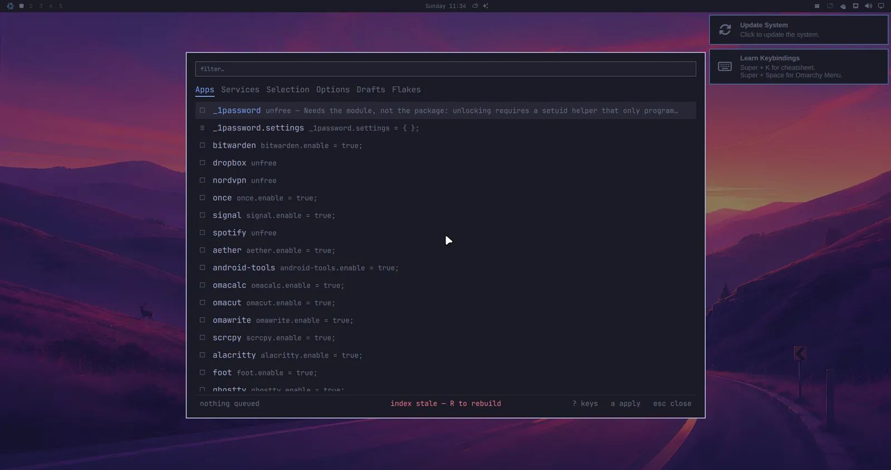
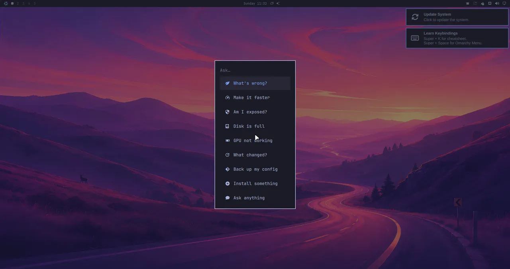
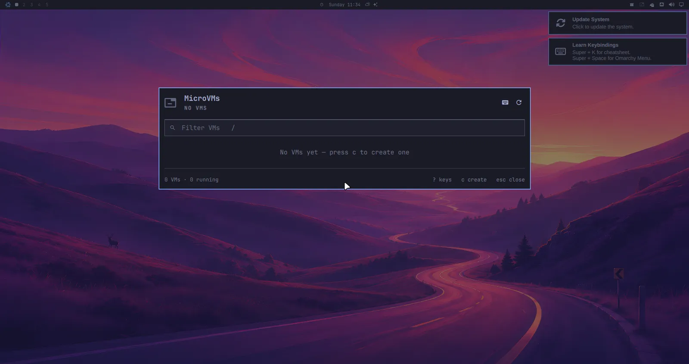

# The Omarchy desktop, on NixOS

[Omarchy](https://omarchy.org) — the Hyprland desktop — vendored as a NixOS
flake, with its menus rewired to Nix instead of pacman.

<div class="cta" markdown="0">
  <a class="cta-button cta-button--primary" href="#install-it">Install it</a>
  <a class="cta-button" href="#see-it">See it in action</a>
</div>

<a id="see-it"></a>

## See it in action








Omarchy 4.x is not a dotfiles repo, it is an application: 445 shell commands, a
QuickShell desktop shell, 22 themes, and Hyprland configured through the Lua API
introduced in 0.55. nixarchy packages that tree as a derivation and replaces the
parts that assume Arch, rather than reimplementing it in Nix. Tracking an
upstream release is a source bump, not a re-port.

## Search everything, install declaratively

The app selection carries 67 applications. **Install ▸ Search** offers the
rest of NixOS — one fuzzy picker over **about 137,000 rows**: every nixpkgs package,
every NixOS option, and the app selection, with each entry's type, default and
documentation in a preview pane.

```
nixarchy > tailscale
app  tailscale                          Tailscale (Service)
pkg  tailscale                          Node agent for Tailscale, a mesh VPN …
opt  services.tailscale.enable          Whether to enable Tailscale client daemon
opt  services.tailscale.authKeyFile     A file containing the auth key …
```

The three kinds are not interchangeable, and the rows say so: the app row gets
you `services.tailscale` with its daemon, the package row gets you the CLI and
nothing running. Picking routes to whichever writer is right. Booleans and enums
get a value picker; anything more complicated is written commented out with its
type and docs beside it, because an option's value is arbitrary Nix and a form
that pretended otherwise would write plausible-looking wrong configuration.

Nothing is built until you apply, and the index comes from *this machine's*
nixpkgs rather than from search.nixos.org — so it can never offer something the
machine will then refuse to build.

[](img/features/install.gif)

See **[other packages](manual/other-packages)** for the whole flow.

## Panels, not terminals

The jobs nixarchy adds to Omarchy live in the shell itself. Each is a panel on
a key, keyboard-first, in the desktop's own look:

- search and install packages, set NixOS options, and apply;
- look after Podman containers;
- follow GitLab pipelines and GitHub Actions;
- see which coding agent in your herdr sessions needs you;
- manage MicroVMs and Distrobox boxes.

Nine ship by default: six are always on, and three turn on with their feature. Voice will be opt-in.

[](img/features/podman.gif)

See **[nixarchy's plugins](manual/plugins)** for what each one does and solves.

## The binary you just downloaded runs

NixOS deliberately has no `/usr/lib`, so a prebuilt Linux binary — a pip
wheel with compiled code, an Electron app, a game — normally dies with
`libGL.so.1: cannot open shared object file`. nixarchy turns the escape
hatches on by default:

- **[nix-ld](https://github.com/nix-community/nix-ld)**, loaded with a
  curated set of what desktop downloads actually link against — `libGL`, the
  X and Wayland client stacks, fontconfig, NSS for Electron, ALSA, ffmpeg —
  so most prebuilt binaries simply run.
- **envfs** mounts `/bin` and `/usr/bin`, so a script whose shebang says
  `#!/usr/bin/python3` runs instead of reporting "No such file or directory"
  about a file you are looking at.
- **AppImages are double-clickable**: binfmt registration runs them directly.

And when something still fails, `nixarchy-doctor <binary>` runs the loader's
own resolution against that file and names the missing library and the
`programs.nix-ld.libraries` line that supplies it.

See **[Python](manual/python)** — named for where people hit this first, but
the loader story covers Node, Electron and games too.

## An agent that knows this machine

Omarchy symlinks its agent skills into every harness's skill directory. Upstream
ships one, written for Arch; nixarchy ships sixteen, written for NixOS.

That matters more than it sounds. A model asked how to install a package on
NixOS will confidently invent an answer; the same model handed the `nixos` skill
routes to `nixarchy-pkg-add` and a rebuild. The skills were written against the
modules on disk rather than from memory, which is how they caught two options
current models still write and that no longer exist.

**Menu ▸ Trigger ▸ Ask** turns them into ten things you can click — *What's
wrong?*, *Make it faster*, *Am I exposed?*, *Disk is full* — each routed to the
skill that answers it, through whichever agent you have chosen.

```nix
programs.nixarchy.localAi.enable = true;
```

runs the whole thing locally against Ollama, with the accelerator derived from
the GPU your configuration already declares. It refuses to build without one,
and the refusal explains why with the measurements behind it.

See **[the AI page](manual/ai)**.

## Get this machine back on new hardware

`nixarchy reinstall iso` builds a bootable image **from this machine's own
configuration**. Boot it on a new laptop and you get this system back —
packages, desktop, services, settings — with nothing downloaded and nothing
compiled, because the closure is on the medium.

**It is not a backup, and the name says so on purpose.** It carries your
system, not your files — no `/home`, no browser profiles, no service state —
and booting it erases the target disk.

See **[a reinstall image of this machine](manual/reinstall-image)**.

<a id="install-it"></a>

## Install it

> **nixarchy is in active development, and you should expect to hit problems.**
> Everything here is being worked on and tested continuously. Please
> [report what you hit](https://github.com/olafkfreund/nixarchy/issues) —
> `omarchy bug-report` collects the useful details for you.

### Already running NixOS? Use the flake

**This is the mature route** — the path with the most use and the most testing
behind it. Adding `nixarchy.nixosModules.nixarchy` to a configuration you
already have touches neither your partitions nor your bootloader, and a bad
result is one `nixos-rebuild --rollback` away.

See **[getting started](manual/getting-started)**.

### On a blank machine, from the ISO

> **The ISO installer writes partition tables and bootloaders on real disks.**
> It is the least settled part of nixarchy, it is the hardest thing here to
> test, and it is where the bugs have been. Try it on a spare machine or a VM,
> and back up anything on the target disk.

```
nix build github:olafkfreund/nixarchy#iso
sudo dd if=result/iso/nixarchy-*.iso of=/dev/sdX bs=4M status=progress oflag=sync
```

Boot it. No boot menu and no login prompt — the installer is what comes up. It
asks the questions Omarchy asks, in the same order, encrypts the disk unless you
opt out, and is done in a few minutes.

[](img/installer/install.gif)

What you end up with is **a flake you own** at `/etc/nixos`: a git repository
holding the disk layout, the configuration and your app selection. A rebuild
straight after installing builds nothing, because everything the installer did
is written there rather than done behind it.

**The ISO carries its own closure, so an install needs no network.** It is
checked with no network device present at all: 2,221 store paths copied from
the medium, zero fetched, nothing built.

See **[the ISO](manual/the-iso)** for the remaining limits.

## → [The nixarchy manual](manual/)

What is different here, and only that. Omarchy's manual covers the desktop; this
one covers the port — packages, updates, rollback, the firewall, the agent
skills, and the NixOS philosophy underneath all of it.

New to NixOS? Start with **[the philosophy](manual/philosophy)** and
**[updating NixOS](manual/updating-nixos)**.

## Elsewhere

- **[The source](https://github.com/olafkfreund/nixarchy)** — and its
  [roadmap](https://github.com/olafkfreund/nixarchy#roadmap), which CI keeps
  honest against the open epics
- **[What is being worked on](https://github.com/olafkfreund/nixarchy/issues)**
- Repository-facing subjects that live in the README rather than here, because
  a second copy is a second thing to keep true:
  [how releases are numbered](https://github.com/olafkfreund/nixarchy#releases),
  [who updates which application](https://github.com/olafkfreund/nixarchy#keeping-applications-updated),
  and [what "vendored, not reimplemented" means](https://github.com/olafkfreund/nixarchy#vendored-not-reimplemented)
- **[Omarchy itself](https://omarchy.org)**, upstream
