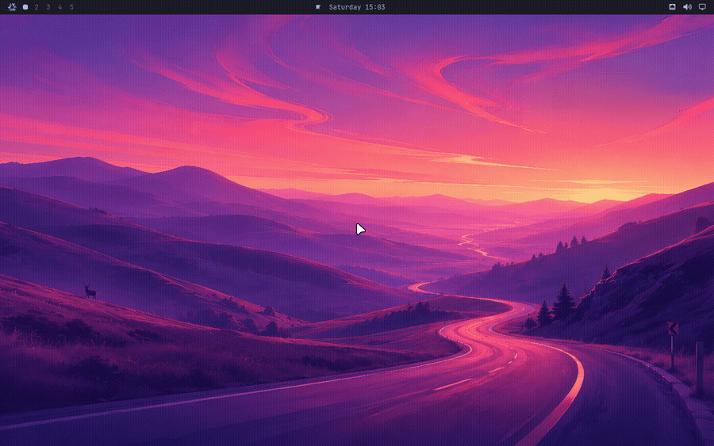

# Configuring nixarchy

Every option the module exposes that is worth a decision, and what each one
defers to. The install paths are in [Getting Started](getting-started); this
page is what to read once the desktop is up and you want it to be yours. It
used to be the middle of the README, and moved here unchanged.

## The module, in one flake


```nix
{
  inputs.nixarchy.url = "github:olafkfreund/nixarchy/v4.0.1-1";

  outputs = { nixpkgs, nixarchy, ... }: {
    nixosConfigurations.mymachine = nixpkgs.lib.nixosSystem {
      modules = [
        nixarchy.nixosModules.nixarchy
        {
          programs.nixarchy.enable = true;
          # Where nixarchy-apply copies your app selection before rebuilding.
          programs.nixarchy.flake = "/home/you/nixos-config";
        }
        ./nixarchy-apps.nix # the generated selection
      ];
    };
  };
}
```

And in Home Manager:

```nix
{
  imports = [ nixarchy.homeManagerModules.nixarchy ];
  programs.nixarchy.enable = true;
  programs.nixarchy.defaultTheme = "tokyo-night";
}
```

## Shell functions

Omarchy's [shell functions](https://omarchy.org/manual/shell-functions/) —
`compress`, `dip`, `hdl`, `tdl`, `iso2sd`, the tmux and git-worktree helpers,
20 in all — come from a bash rc chain that also sets aliases and `EDITOR`. It
needs no patching here: every path in it resolves through `OMARCHY_PATH`.

It is on by default, and opinionated: it aliases `ls` to eza, `cd` to zoxide
and `g` to git. Turn it off if you bring your own shell config:

```nix
programs.nixarchy.bashIntegration = false;
```

Left on, it loads from `/etc/bashrc` — *before* `~/.bashrc` — so anything you
define yourself still wins. Nothing in the desktop depends on it: the menus
call the `omarchy-*` executables directly, not these functions.

## Plugins

[Omarchy's plugin system](https://omarchy.org/manual/plugins/) works here
unchanged — the menu below is upstream's own, running on NixOS:


Two published third-party plugins, installed into that session and then turned
off again. The top bar is the same bar in both strips — the teleprompter glyph
beside the clock and the widget-toggle icon on the right are
[omteleprompt](https://github.com/seyhunak/omteleprompt) and
[omarchy-bar-toggle](https://github.com/r3mcos3/omarchy-bar-toggle):


Both frames come out of `checks.plugin`, which installs those two plugins from
their real repositories on every push and fails if the shell does not load
them. Adding one is a command, not a rebuild:

```bash
omarchy plugin add https://github.com/seyhunak/omteleprompt.git --enable
```



Or from the menu above, which is where most people will find it. Add opens a
floating terminal and asks for the URL. Those rows are upstream's own — nixarchy
adds none and, more to the point, takes none away: the menu you see is Omarchy's default with the
nixarchy extension merged over it by id, and that extension rewrites only the
`install.*` and `remove.*` rows. The check asserts it never names a
`setup.plugin.*` id, because an override that did would hide the row with no
error anywhere.

That clones into `~/.config/omarchy/plugins/` at runtime and the running shell
picks it up — no rebuild, no flake edit, nothing added to `apps.nix`. It is
upstream's design and nixarchy keeps it: a plugin is somebody's QML loaded into
your bar, and pinning that in a flake would make trying one a five-minute
round trip instead of a command.

Two things make it work on NixOS that would otherwise be quiet failures, and
both are covered by `nix build .#checks.x86_64-linux.plugin`, which installs two
real published plugins and then removes them again:

- **`~/.config/omarchy` is a real directory, not a store symlink.** Home Manager's
  usual answer for a config file is a read-only link into `/nix/store`. The seed
  uses `cp -rn` instead, so `plugin add` can write there at all.
- **A plugin gets whatever `pkgs/omarchy/default.nix` declares, and nothing else.**
  Plugins shell out to commands they assume are present — omteleprompt's voice
  mode runs `python3`, `parecord` and `arecord`. On Arch those are just there.
  Here they are on the list, and the check keeps them there. A plugin needing
  something that isn't will fail silently inside a QML `Process`, so if one
  misbehaves, that is the first thing to look at.

### Declaring plugins in your configuration

Plugins can also be pinned, so a machine rebuilt from your flake comes up with
them already there:

```nix
programs.nixarchy.plugins.omteleprompt.src = pkgs.fetchgit {
  url = "https://github.com/seyhunak/omteleprompt.git";
  rev = "9a35865220a0c9d65132329e446a84c466545110";
  hash = "sha256-KJM/AC1DnPwob40lo39Rlk9qkyKTI++bss1wPIcGsTs=";
};
```

`src` is any directory with a `manifest.json` at its root — a `fetchgit`, a
flake input, or a path in your own repo while you write one.

This works because upstream already separates the two halves: a plugin's *code*
lives in `~/.config/omarchy/plugins/<id>/`, while whether it is enabled and
where it sits in the bar are recorded in `~/.config/omarchy/shell.json` by the
running shell. So the code can come from the store — the directory is a symlink,
which upstream's scan follows and `omarchy plugin remove` has an explicit branch
for — without freezing anything the user changes at runtime.

Three consequences worth knowing, all of them deliberate:

- **It installs a plugin; it does not enable one.** Enable it once from
  Setup → Plugins and that choice sticks, because it is recorded in
  `shell.json` rather than in the plugin folder. Managing enablement from Nix
  would mean a plugin you turned off came back at the next rebuild.
- **The id comes from the plugin's own `manifest.json`**, not from the
  attribute name. It is what the shell, the menu and every `omarchy-plugin-*`
  command key on, so a folder named anything else would be a plugin you could
  not enable or remove by the name on screen.
- **A broken manifest fails the rebuild**, checked with upstream's own
  `omarchy-plugin-validate` rather than a copy of its rules — so it cannot
  drift at the next Omarchy bump. You find out at `nixos-rebuild` instead of
  after logging in to a plugin that installed and does nothing.

`omarchy plugin add` still works alongside this, and the two do not collide: a
plugin you add by hand is a real directory this never touches, and adding one
whose id you already declare is refused rather than installed twice.

Plugins run unsandboxed inside your long-lived shell process. Upstream warns
about this at the prompt and refuses `ext::`-style URLs that would run a command
at clone time; both behaviours are intact here.

### nixarchy's own plugins

A few plugins are part of nixarchy itself, and those are the exception to "it
installs, it does not enable". **nixarchy.pkg**, the package manager panel, is
installed wherever nixarchy is, turned on at your first login, and opened from
**Install ▸ Packages** or, on a new install, **Super+Alt+N**. **nixarchy.podman**,
the Podman panel, follows podman rather than nixarchy: it comes with the Podman
service row or with boxes, opens from **Apps ▸ Podman** or **Super+Alt+O**, and
is absent where podman is off (the key then says the panel is not installed).

The GitLab pipelines panel ([nixarchy-gltui](https://github.com/olafkfreund/nixarchy-gltui))
is the same: installed with `glab`, on at your first login, opened from
**Apps ▸ GitLab Pipelines** or **Super+Alt+P** (its keys: **Super+Ctrl+Alt+P**).
It needs `glab auth login` once; until then it says so and stops polling.

"Once" is the point. A marker in `~/.local/state/nixarchy/enabled-once/` records
that it was turned on, so if you turn it off in Setup → Plugins it stays off. To
stop nixarchy installing one at all:

```nix
programs.nixarchy.defaultPlugins.pkg = false;
programs.nixarchy.defaultPlugins.podman = false;
programs.nixarchy.defaultPlugins.gitlab = false;
```

That never edits your `shell.json`, so a plugin you already have on stays on
until you turn it off there. If you already declare it yourself through
`programs.nixarchy.plugins`, your `src` wins.

## RetroArch cores

`pkgs.retroarch` is `retroarch-with-cores` built with an **empty** core list,
so installing it plainly gives an emulator that can run nothing.
`programs.nixarchy.apps.retroarch` therefore ships its own build with 13 cores
— every core Omarchy's own picker offers that nixpkgs carries under a free
licence, with bsnes and blastem standing in for the unfree snes9x and
genesis-plus-gx.

`retroarch-full` would be the obvious alternative and is the wrong one: it
pulls unfree cores, and a single unfree package in the app list aborts the
whole rebuild rather than failing on its own. nixarchy allows unfree by
default, so widening the set is just the override:

```nix
programs.nixarchy.apps.retroarch = {
  enable = true;
  package = pkgs.retroarch.withCores (c: [ c.snes9x c.mame c.dolphin ]);
};
```

Whatever you pick shows up in the menu picker: upstream filtered the core
directory against 22 hardcoded names, which would have hidden anything you
added, so nixarchy lists what is actually installed and takes the labels from
`libretro-core-info`.

## Binary cache

Enabling nixarchy otherwise means compiling a compositor: it takes Hyprland
from hyprwm's own flake, tracking their branch rather than nixpkgs' packaging.
The module adds both caches for you:

```
https://nixarchy.cachix.org   the vendored tree and this flake's own packages
https://hyprland.cachix.org   hyprwm's own builds -- the compositor and its
                              portal, which is why nothing here compiles one
```

`programs.nixarchy.binaryCaches = false` if you would rather trust neither and
build from source. This is the one setting worth a deliberate decision:
substituters are a list, so they merge into whatever you already trust without
any conflict to warn you.

## Neovim, and the config you may already have

On Arch, Omarchy's Neovim setup arrives as an `omarchy-nvim` package. That
package has no published source — it is not in the basecamp org and the
repository serves binaries — but Omarchy carried the same files in-tree as
`config/nvim` until v3.0.2, and `pkgs/omarchy-nvim/` is that tree, byte for
byte, at the last revision anyone can read.

It is three files and under three kilobytes, because it is not a Neovim
distribution: it is **LazyVim**, plus what Omarchy changes about it. LazyVim
still resolves and locks its own plugins at runtime, exactly as on Arch.

Neovim itself is installed either way — it is one of the omarchy package's
runtime dependencies, as it is one of upstream's base packages. The only
question is `~/.config/nvim`, which is yours:

```nix
programs.nixarchy.neovim = "theme-only";   # the default
```

| | `theme-only` (default) | `adopt` | `off` |
|---|---|---|---|
| **no `~/.config/nvim`** — a fresh install | seed the config, link the theme | same | nothing |
| **you have one, no `theme.lua`** | add only the theme link | same | nothing |
| **you have a real `theme.lua`** | keep yours, say so | keep yours, and name what will collide | nothing |

**Nothing here ever overwrites a file you wrote,** and there is no setting that
does — an editor configuration is not this module's to replace. The seed fires
only into a directory that does not exist, because half-seeding is worse than
not seeding: LazyVim reads every `.lua` under `lua/plugins` as a plugin spec,
so dropping Omarchy's into someone else's config means their setup silently
loads two it never asked for.

The theming is one symlink:

```
~/.config/nvim/lua/plugins/theme.lua → ~/.local/state/omarchy/current/theme/neovim.lua
```

All 22 themes ship a `neovim.lua`, and that link is what reads it. It is set
only when the path is absent or already a symlink — the same rule upstream's
own migrations follow.

`adopt` adds nothing to what is written; it names the collisions instead. A
`lua/plugins/colorscheme.lua` beside the link is two LazyVim specs setting
`opts.colorscheme`, and a Home-Manager-owned `~/.config/nvim` is a tree the
link cannot be written into at all. Both work alone and disagree together,
which is the kind of thing worth being told once rather than debugging.

## Naming the user who runs the desktop

```nix
programs.nixarchy.user = "alice";
```

Optional, and worth setting. A NixOS machine has many users and the module
cannot guess which one logs into Omarchy, so the few things that need a name
are skipped rather than applied to someone arbitrary. Today that is the
**`input` group** — upstream's installer runs `usermod -aG input`, and without
it the dictation tools and game controllers Omarchy offers cannot read their
devices.

`browserThemeUser` is deliberately *not* defaulted from it: naming the desktop
user should not silently hand them the browsers' policy directories.

## The boot splash and the login screen

Two different screens, with two very different answers.

**The boot splash** is nixarchy's own: the NIXARCHY wordmark draws itself in
with a ttfx text effect -- the same engine the screensaver runs, over the same
ASCII banner -- and a progress bar fills underneath it. The animation is
rendered to stills when the package is built, because Plymouth has no terminal
for ttfx to draw in. The bar is a change from upstream, which shows it only
after a passphrase prompt, so a machine with no encrypted disk never saw it.

It yields to anything that names a theme of its own — stylix does, so a
stylix machine keeps the stylix splash. To take nixarchy's instead:

```nix
programs.nixarchy.bootSplash = "force";
```

`force` moves `boot.plymouth.theme` **and** `themePackages` together. Reaching
for `lib.mkForce` on the theme alone does not work: NixOS asserts the named
theme exists in the package list, and on a stylix machine stylix still owns
that list, so the build fails on a theme it cannot find. `"off"` leaves
`boot.plymouth` alone entirely.

**The login screen is SDDM-only, and this is a real limitation.** Omarchy's
greeter is an SDDM theme — `Main.qml` plus assets, written against SDDM's own
`userModel` and `login()` API. It is not a program greetd can run, and upstream
ships nothing for greetd. So:

- **On SDDM** you get it automatically. `programs.nixarchy.displayManager` is
  on by default and sets `services.displayManager.sddm.theme = "omarchy"`,
  branded with the NIXARCHY wordmark.
- **On greetd** you cannot have that screen. Your greeter keeps greeting and
  picks up the Omarchy session like any other — which is what
  `programs.nixarchy.displayManager = false` is for. Switching to SDDM to get
  it means giving up greetd, and two display managers is not a working
  configuration.

There is no third option today. Porting the QML to a greetd greeter would mean
rewriting it against a different login API, which is a fork of upstream's
greeter rather than a setting.

## Apps you already have

The Install menu dims a row when the app is already there — whether it is in
your selection, or you installed it yourself and nixarchy knows nothing about
it. That second case is the one worth naming: an app in your own
`environment.systemPackages` or `home.packages` used to be offered as though
you had nothing, and taking the offer wrote a second declaration for something
you already run.

`nix run github:olafkfreund/nixarchy#doctor` reports the overlap before you
install anything:

```
Omarchy apps you already have
  15 of them, and nixarchy will not install a second copy:
    Alacritty
    Chrome
    Firefox
    ...
```

Both the report and the menu look for the same thing — the app's command on
PATH — so what the doctor lists and what the menu dims agree. The command comes
from nixpkgs' own `meta.mainProgram`, read at evaluation time without building
anything, because the attribute name is wrong often enough to matter: `vscode`
puts `code` on PATH and `obs-studio` puts `obs`.

**Remove rows deliberately do not work this way.** They stay bound to the
selection, because deselecting is the only removal nixarchy is allowed to
perform. An app that arrived from your own configuration is not this menu's to
take away.

## The selection has to be imported

`nixarchy-apply` copies `~/.config/nixarchy/apps.nix` to your flake root as
`nixarchy-apps.nix`. A flake cannot read a file outside its own tree, so the
copy is unavoidable — but **importing it is yours to do**:

```nix
imports = [ ./nixarchy-apps.nix ];   # path relative to the file you add it to
```

Without that line the menu marks apps enabled, apply reports a copy, the
rebuild runs to completion, and **nothing is ever installed**. `apply` now says
so loudly rather than leaving you to work it out from an app that never
appears.

## Why it isn't a package list

Several of these are **not packages** on NixOS, and a flat `systemPackages`
list would have been quietly wrong:

| app | what it actually needs |
|---|---|
| Steam | `programs.steam` — an FHS wrapper, or it will not run |
| 1Password | `programs._1password-gui` — a setuid helper, or it cannot unlock |
| Xbox controllers | `hardware.xpadneo` — a kernel driver |
| Firefox | `programs.firefox` — so policies and extensions stay declarative |

`data/apps.nix` records which is which, and per-app `settings` merge at that
app's own option path:

```nix
programs.nixarchy.apps._1password = {
  enable = true;
  settings.polkitPolicyOwners = [ "you" ];   # → programs._1password-gui.polkitPolicyOwners
};
```

Services — Tailscale, remote desktop, Syncthing, OpenSSH — are the companion
catalogue in `data/services.nix` and a file of their own. A service nixarchy
only relays gets upstream's own line, `services.openssh.enable = true;`; one it
integrates gets an option, `programs.nixarchy.services.tailscale.enable`. There
is no `settings` passthrough on those, because upstream's options are still
upstream's and are written beside ours:

```nix
programs.nixarchy.services.tailscale.enable = true;   # + trusts the interface
services.tailscale.useRoutingFeatures = "client";     # upstream's option, untouched
```

## On a machine you already run

`nix run github:olafkfreund/nixarchy#doctor` reads the running system and
prints the configuration that machine needs, before nixarchy is an input
anywhere. The steps are in the README's
[Install](https://github.com/olafkfreund/nixarchy#on-nixos-you-already-run);
this is what the doctor's findings mean, and what the module leaves alone.

Three of the things it reports are worth knowing about in advance, because
each fails *silently*, or misleadingly, rather than loudly:

**Your session may be running an older build than the one installed.**
`OMARCHY_PATH` and `PATH` are set at login and keep pointing at whichever store
path was current then. A `nixos-rebuild switch` installs a new package at a new
path and cannot change the environment of a session already running, so every
`omarchy-*` command the desktop executes -- every keybinding, every menu row --
comes from the old build until you log out and back in. The doctor compares the
two and says so. On Arch this cannot happen: the tree lives at a fixed
`/usr/share/omarchy` overwritten in place, and a running session picks up a new
version at once. Here the path itself changes.

**`Setup > Default browser` may report success and change nothing.** If
`mimeapps.list` is a store symlink -- which is what `xdg.mimeApps` in Home
Manager produces, and the right way to declare it -- `xdg-settings` fails on the
read-only file and *still exits 0*. `omarchy-default-browser`'s `|| exit 1` never
fires. Nothing is broken and nothing says so, which is the only reason it is
worth a section: the fix lives in a file the menu cannot reach.

**A tmpfs `/tmp` smaller than 64 GiB will fail a rebuild as a full disk.** Nix
builds in `$TMPDIR`. When that is a tmpfs it is RAM, not the filesystem `df`
reports on, and a desktop rebuild unpacking several large sources at once
(`cef-binary` alone is ~1.9 GiB unpacked) can exhaust it. What you get is `No
space left on device` and nix's own hint to check free disk space -- on a
machine with hundreds of gigabytes free. Nothing in the error names tmpfs, RAM
or `$TMPDIR`. The doctor names the size and both remedies, and sets neither:
`boot.tmp.*` is your machine's memory policy.

## After it is installed

```sh
nix run github:olafkfreund/nixarchy#verify
```

From inside a running Omarchy session. Everything this repo checks in CI runs
in a machine with no GPU, no Bluetooth radio, no network and no sound -- which
catches a great deal and cannot answer whether the compositor got hardware
acceleration, whether bluetoothd sees an adapter, or whether the RetroArch
cores landed where RetroArch looks. This asks those, and prints what it found
rather than a verdict: `llvmpipe` and `AMD Radeon` are both a pass to a script
and mean opposite things to a person.

On a laptop with hybrid graphics it reads:

```
Session    ✓ Omarchy shell running        pid 2019165
Graphics   ✓ hardware rendering
             Mesa Intel(R) UHD Graphics (CML GT2)
             Intel CometLake-H GT2 [UHD Graphics]
             NVIDIA GA104M [GeForce RTX 3080 Mobile / Max-Q 8GB/16GB]
Bluetooth  ✓ bluetoothd sees 1 adapter(s)
Theme      ✓ portal reports dark          ✓ cursor follows the theme
Shell      ✓ functions wired in           ✓ compose sequences resolve

16 passed, 0 failed, 3 worth a look
```

It distinguishes **absent from broken**: on a machine that has never installed
Omarchy the checks that need it report as notes, not failures, and the header
names the desktop that *is* running.

## If you already have a `~/.config/hypr/hyprland.lua`

Nothing is overwritten, and you keep both desktops. The seed never replaces a
file you own, so Omarchy's own `hyprland.lua` is not installed — and it does not
need to be. The **Omarchy** session entry runs Hyprland with `--config` against
Omarchy's copy in the store, so your Hyprland session stays exactly yours and
Omarchy's is Omarchy's. Pick whichever at the greeter.

You will see one line on rebuild saying so. The only case that warns is
`programs.nixarchy.session = false` *and* a Home Manager-owned `hypr/` — with
no session entry and no installed config, that configuration has Omarchy's
applications and menus but no way to reach its desktop.


Nixarchy never overwrites a file you own, so Omarchy's own `hyprland.lua` is
not installed and nothing in `~/.config/hypr` starts its bar or binds its keys.

The **Omarchy** session is the answer, and it is registered by default. It runs
Hyprland against Omarchy's own config with `--config`, so it needs no file of
yours: your session stays yours, and Omarchy's is Omarchy's. `nix build
.#checks.x86_64-linux.coexist` boots exactly that arrangement -- a foreign
`hyprland.lua` in place, the Omarchy session launched from its own `.desktop`,
and the desktop asserted to render.

The two sessions share
`~/.config/hypr/{monitors,input,bindings,looknfeel,autostart}.lua`, because
Omarchy's bootstrap builds Hyprland's Lua module path from `$HOME/.config` and
nothing else. Only the entry point differs, so editing those changes both.

## What defers to you automatically

Every system service the module turns on is `mkDefault`, so your own settings
win rather than colliding. If you already run Docker your way, or
systemd-networkd instead of NetworkManager, or Plymouth off, nothing here
argues with you.

Two cases are handled rather than merely deferred:

| Your machine | What happens |
| --- | --- |
| TLP for power management | power-profiles-daemon is left off; NixOS forbids both. `omarchy powerprofiles` stops working, nothing else does |
| GDM, LightDM, greetd or ly | set `displayManager = false`; your greeter picks up the **Omarchy** entry from `wayland-sessions` and you lose only the branded greeter |
| Hyprland already configured | log in through the **Omarchy** session. It runs Hyprland against Omarchy's own `hyprland.lua` via `--config`, so it never needs `~/.config/hypr/hyprland.lua` and your session keeps working |

Two are not, because they are not nixarchy's to resolve:

- **PulseAudio.** NixOS enables PipeWire for any graphical session and asserts
  the two cannot coexist. A plain `programs.hyprland.enable = true` with
  PulseAudio fails the same way, with no nixarchy in sight.
- **Hyprland itself.** `programs.hyprland.enable`, its package and `withUWSM`
  are set outright, not with `mkDefault`. Omarchy is written against Hyprland's
  Lua API; replacing the compositor means `lib.mkForce`, which is the right
  amount of friction for that. If you already pin your own Hyprland, `mkForce`
  it -- anything from 0.55 satisfies the assertion.

The two sessions do share `~/.config/hypr/{monitors,input,bindings,looknfeel,
autostart}.lua`, because Omarchy's bootstrap builds Hyprland's Lua module path
from `$HOME/.config` and nothing else. Only the entry point differs.
