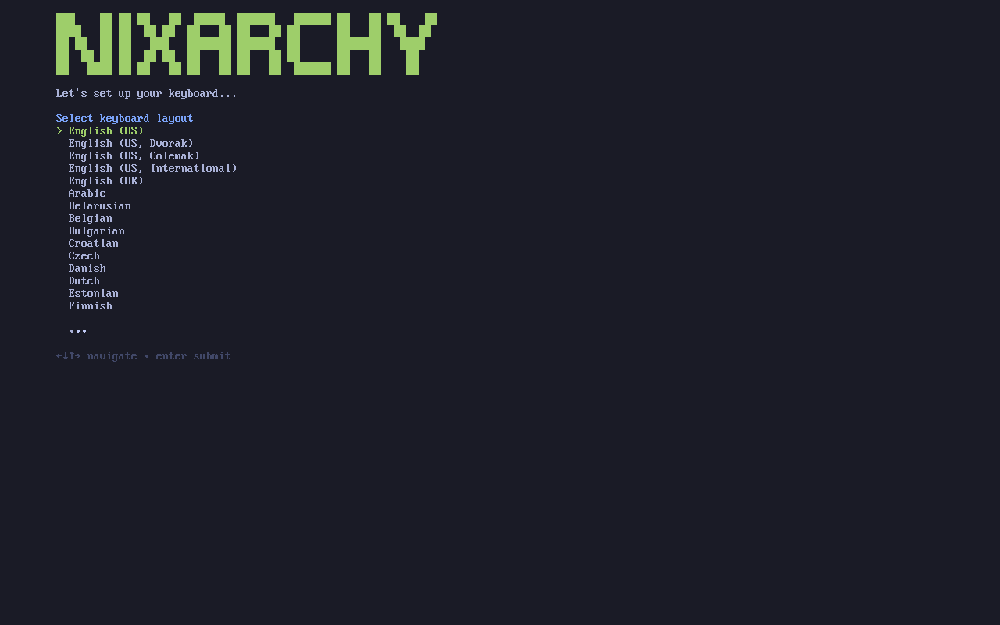
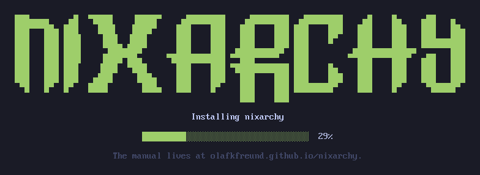

# Getting Started

Omarchy ships as an ISO: boot it, answer a few questions, and a machine comes
out the other end. **nixarchy does that now too** — and it is also still a flake
you can add to a machine that already runs NixOS. Two ways in, and which one you
want depends on whether the drive is blank.

## The ISO

```
nix build github:olafkfreund/nixarchy#iso
sudo dd if=result/iso/nixarchy-*.iso of=/dev/sdX bs=4M status=progress oflag=sync
```

Boot it. There is no boot menu and no login prompt; the installer is what comes
up. It asks for a keyboard layout, a username and password, a hostname, a
timezone and a disk — the same questions upstream asks, in the same order.



Encryption is on unless you press Ctrl+C at the overwrite warning, and one
password serves your user, root and the disk alike.




Reboot and you are at the desktop. On an encrypted install you go straight
there: the passphrase you typed at boot already proved who you are.

What you end up with is **a flake you own** at `/etc/nixos` — a git repository
holding `flake.nix`, `configuration.nix`, the disk layout that formatted the
disk, and your app selection. Edit it, run `nh os switch`. A rebuild immediately
after installing builds nothing, because everything the installer did is
described in those files rather than done behind them.

Two things to know first. **The image needs a network:** it downloads the
closure rather than carrying it, so an install is as fast as your connection.
Making it offline is the next phase of the work. And it is **UEFI only** — the
layout is an ESP with systemd-boot, and there is no BIOS path.

## Or: add it to NixOS you already run

If the machine already runs NixOS, you do not want the ISO. The rest of this
page is that path.

## 1. Install NixOS

Use the official NixOS installer and get to a booting system with a user
account. Two things worth deciding at that stage, because nixarchy inherits
them rather than setting them:

| Upstream default | Here |
|---|---|
| Full-disk encryption, mandatory | Yours to choose during the NixOS install (LUKS is a checkbox in the graphical installer). nixarchy does not add it afterwards. |
| Limine boot loader with snapshots | Whatever boot loader you picked; systemd-boot is the common one. Rollback comes from NixOS generations, see [system snapshots](system-snapshots.md). |

Upstream's note about Bluetooth keyboards still holds if you encrypt: the
passphrase prompt runs before Bluetooth, so use a wired or 2.4 GHz keyboard.

## 2. Run the doctor first

```sh
nix run github:olafkfreund/nixarchy#doctor
```

It reads the running system and prints the configuration this particular
machine needs, before nixarchy is an input anywhere. It changes nothing. On a
machine that already has Hyprland behind greetd, for example, it tells you to
keep your greeter and your Hyprland package rather than letting the rebuild
fail on the conflict. Paste what it prints into the module block in the next
step.

## 3. Add the flake input

From the README, the whole of it:

```nix
{
  inputs.nixarchy.url = "github:olafkfreund/nixarchy/v4.0.1-1";

  outputs = { nixpkgs, nixarchy, ... }: {
    nixosConfigurations.mymachine = nixpkgs.lib.nixosSystem {
      modules = [
        nixarchy.nixosModules.nixarchy
        {
          programs.nixarchy.enable = true;
          # Where nixarchy-apply copies your app selection before rebuilding.
          programs.nixarchy.flake = "/home/you/nixos-config";
        }
        ./nixarchy-apps.nix # the generated selection
      ];
    };
  };
}
```

And for the user who will sit at the desktop, in Home Manager:

```nix
{
  imports = [ nixarchy.homeManagerModules.nixarchy ];
  programs.nixarchy.enable = true;
}
```

Without the Home Manager half there is no app selection, no theme state and no
seeded config. Pin a release tag rather than `main` unless you want the desktop
moving under you.

Two lines deserve a second look:

- **`programs.nixarchy.flake`** is the directory `nixarchy-apply` copies your
  app selection into. It defaults to `/etc/nixos`; most people keep their flake
  in a git repo under `~`, so set it.
- **`./nixarchy-apps.nix`** must be imported by you. `nixarchy-apply` writes
  that file into the flake root, but a flake cannot read outside its own tree
  and nothing imports the copy on your behalf. Leave the line out and the
  Install menu marks apps enabled, the rebuild succeeds, and nothing is ever
  installed. `nixarchy-apply` warns loudly when nothing imports the file, so
  read what it prints.
- **Unfree packages are allowed by default.** Most of what the Install menu
  offers is unfree — the browsers, the editors, Steam, the AI clients — so
  enabling nixarchy sets `nixpkgs.config.allowUnfree`. Turn it off with
  `programs.nixarchy.allowUnfree = false;` — and turn it off *there* rather
  than setting `nixpkgs.config.allowUnfree = false` yourself, because
  `nixpkgs.config` is a free-form attribute set where two definitions of the
  same key do not resolve by priority, and yours would not win.

## 4. Rebuild, log out, pick Omarchy

```sh
sudo nixos-rebuild switch --flake /home/you/nixos-config
```

Every remaining conflict shows up here as an evaluation error, not as a broken
machine. Then log out and choose the **Omarchy** session at the login screen.
On SDDM the login screen is Omarchy's own branded greeter; on greetd, GDM or
LightDM you keep your greeter and it offers the Omarchy entry like any other
session.

If you already have a `~/.config/hypr/hyprland.lua`, it is not touched. The
Omarchy session runs Hyprland against Omarchy's config in the store, so both
desktops keep working and you choose between them at the greeter.

## 5. Check it from inside

```sh
nix run github:olafkfreund/nixarchy#verify
```

Run from the Omarchy session. It asks the questions CI cannot: hardware
rendering or llvmpipe, whether bluetoothd sees an adapter, whether the shell
functions and compose sequences are wired in. It prints what it found rather
than a verdict.

## What is different from here on

Installing software is the first thing that will surprise you: the Install
menu edits `~/.config/nixarchy/apps.nix` and builds nothing until you choose
*Apply changes*. Read [the NixOS philosophy](philosophy.md) before anything
else in this manual; every other difference follows from it.

## Help if you're stuck

Upstream's `#omarchy-help` on [the Discord](https://omarchy.org/discord) is
for Arch. For nixarchy-specific trouble, run
`nix run github:olafkfreund/nixarchy#doctor`, read
[troubleshooting](troubleshooting.md), and open an issue on the repository with
the output of `omarchy debug --no-sudo --print`.
