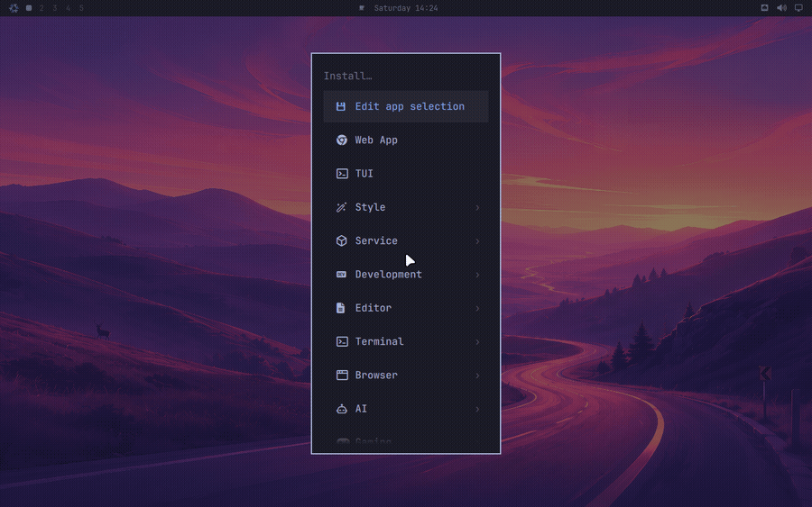

# Other packages

Upstream's page is three paragraphs: pick a package from _Install > Package_,
pick one from _Install > AUR_, remove one from _Remove > Package_. All three run
pacman. None of that applies here, and the reasons are on the
[philosophy page](philosophy.md), so this page is about what you do instead.

## The apps the menu knows about

The Install menu still exists and still has every row Omarchy ships. Each row
has been mapped to how NixOS installs the thing: 56 apps in total, of which 41
are plain nixpkgs packages, 5 are NixOS modules, 8 are built by nixarchy
itself because nixpkgs does not carry them, and 2 have no equivalent and say
so in the menu.

Picking a row does not install anything. It uncomments one line in
`~/.config/nixarchy/apps.nix`, which is a file nixarchy writes for you, fully
populated with every app and every line commented out. Pick five rows and you
have five uncommented lines. Then _Install > Apply changes_ runs
`nixarchy-apply`, which copies that file to `nixarchy-apps.nix` in your flake
directory and offers to run `nh os switch <flake>`.

## Finding it in the first place

`nixarchy-search`, or _Install > Search_, is one fzf picker over every nixpkgs
package, every NixOS option and the curated app list, with each entry's type,
default and description in a preview pane. Picking a row routes it: an app is
enabled as an app, a package is appended as a package, and an option is written
as a line of its own -- booleans and enums get a value picker, anything more
complicated is written commented out with its type and docs beside it, for you
to fill in.

The index comes from this machine's own nixpkgs and its own options rather than
from search.nixos.org, which costs about a minute once per system generation and
means the picker can never offer something this machine cannot build.

The same thing from a terminal:

```sh
nixarchy-app-enable helix      # uncomment the line
nixarchy-app-disable helix     # comment it back out
nixarchy-apply                 # copy into the flake and rebuild
```

The ids are the ones in `apps.nix`; `omarchy pkg install` prints the file's
location and nothing else, because it is the list.



One thing has to be true for any of this to work: **your flake must import the
file.**

```nix
imports = [ ./nixarchy-apps.nix ];
```

Without that line every app looks enabled in the menu and nothing is ever
installed. `nixarchy-apply` checks for it and warns loudly, but it cannot add
it for you — the flake is yours, and nixarchy does not edit it.

## Why some rows are modules, not packages

On Arch a package is a package. On NixOS a handful of the apps need more than
files on disk, and for those the row enables a NixOS option instead:

| App | Option | Why a package would not do |
|---|---|---|
| Steam | `programs.steam` | Needs an FHS wrapper to run at all |
| 1Password | `programs._1password-gui` | Unlocking needs a setuid helper |
| Firefox | `programs.firefox` | Policies and extensions become declarative |
| Xbox controllers | `hardware.xpadneo` | A kernel driver |

Rows like these — and only these, the ones with an option to merge into —
accept settings. `apps.nix` is an ordinary NixOS module, so you can write

```nix
programs.nixarchy.apps._1password.settings.polkitPolicyOwners = [ "you" ];
```

beside the selection, and it is merged into `programs._1password-gui`.

## Services are the other file

Tailscale is not on that list, and neither is anything else that is a decision
about the machine rather than a package. Those live in `services.nix`, beside
`apps.nix` in `~/.config/nixarchy/`, with a catalogue of their own. It holds
two kinds of line, and the difference is what you need to know before tuning
one:

```nix
services.openssh.enable = true;                        # upstream's own option
programs.nixarchy.services.tailscale.enable = true;    # a nixarchy option
```

The first kind is there because nixarchy had nothing to add: you get the real
NixOS option, the same line every wiki page and forum answer will show you.
Configure it exactly as its own documentation says.

The second kind is there because turning the thing on usefully takes more than
one option — Tailscale needs the firewall to trust the interface, or this host
can reach your tailnet and nothing on your tailnet can reach it.

Bundled services have no `settings` passthrough and do not need one. Upstream's
options are not re-declared and not taken away, so you write them directly, in
the same file:

```nix
programs.nixarchy.services.tailscale.enable = true;
services.tailscale.useRoutingFeatures = "client";   # upstream's option, untouched
```

That is the design rather than an omission. An option copied from upstream goes
stale and cannot be removed once people depend on it, so nixarchy declares only
what it genuinely integrates and leaves the rest of `services.tailscale` where
you already know how to look it up.

## Unfree software

Chrome, VSCode, Cursor, Spotify, Steam and a few others are unfree in nixpkgs.
**nixarchy allows unfree packages by default**, so all of them install without
you doing anything — most of what the Install menu offers is unfree, and a
licence error partway through a rebuild helps nobody.

To get nixpkgs' own policy back instead:

```nix
programs.nixarchy.allowUnfree = false;
```

or `nixpkgs.config.allowUnfreePredicate` if you would rather list them.

## Anything the menu does not offer

Upstream answers "something else" with _Install > Package_ and a fuzzy list of
every Arch package. There is no such list here — `omarchy pkg add <name>`
prints the declarative route and exits 1 — because nixarchy owns the Omarchy
installation and its apps, not your system configuration.

Search [search.nixos.org/packages](https://search.nixos.org/packages) (also
_Learn > Nixpkgs_ in the menu), then add it where the rest of your machine is
declared:

```nix
environment.systemPackages = with pkgs; [ ripgrep-all ];
```

and rebuild. If you feed `omarchy pkg add` an Arch package name, it will often
translate it: fonts are answered with `fonts.packages`, PHP extensions with
`php.withExtensions`, the 32-bit graphics libraries with
`hardware.graphics.enable32Bit`, because each of those is a different shape on
NixOS and `systemPackages` would be the wrong answer.

## Removing

_Remove > App_ runs `nixarchy-app-remove`, a picker over whatever is
currently enabled in `apps.nix`. It only ever deselects; then
`nixarchy-apply` rebuilds without the app. Its files go away when the old
generation is garbage-collected, and its config under `~/.config` stays, as on
any system.

Two things it deliberately will not do. It will not remove something you added
in your own `systemPackages` — that is not this menu's to take away; delete the
line yourself. And it will not run `omarchy pkg drop`, which still calls
pacman and cannot work here.
