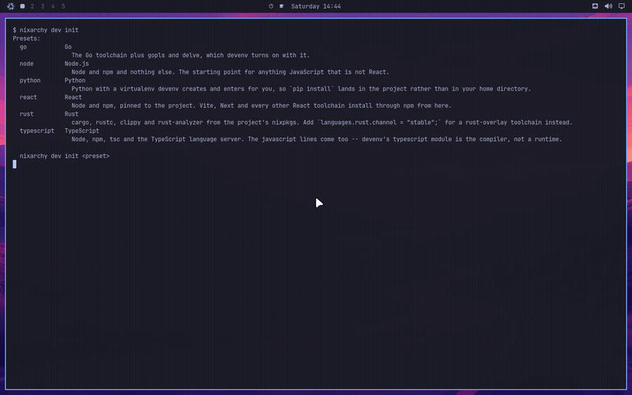

# Per-project environments

One folder, one command, and the folder has a working toolchain that appears
when you `cd` in and is gone when you leave:

```sh
mkdir hello-react && cd hello-react
nixarchy dev init react
```

The next prompt in that directory is inside the environment, and `node
--version` answers the project's Node rather than the machine's. Nothing was
installed on the machine: that Node is pinned in a file the project owns, and
committing that file is how a colleague gets the same one.



This is nixarchy's, not Omarchy's — upstream reaches for `mise use`, which
[Development tools](development-tools) explains does not fit here. It is also
not on by default.

## Turning it on

devenv is a row in the services catalogue, off until you pick it:

```sh
nixarchy-service-enable devenv
nixarchy apply
```

or, in your own configuration:

```nix
programs.nixarchy.services.devenv.enable = true;
```

**Then open a new shell.** What makes a project activate is a hook in
`/etc/bashrc`, `/etc/zshrc` or `/etc/fish/config.fish`, and a shell that
started before the rebuild read the old one. The hook is guarded, so such a
session stays silent rather than printing `devenv: command not found` at every
prompt — which also means nothing tells you to log out. `nixarchy doctor` says
it instead:

```
devenv is selected but not on this session's PATH
```

The rebuild also adds `devenv.cachix.org` as a substituter, so the first `cd`
into a project downloads what Cachix already built rather than compiling a
toolchain. Decline it with
`programs.nixarchy.services.devenv.binaryCache = false;` if you would rather
not trust that cache; the environments still work, they are just built locally.

## What `nixarchy dev init` writes

`nixarchy dev init` with no argument lists the presets — `react`, `node`,
`typescript`, `python`, `ml`, `jupyter`, `go`, `rust`. With one, it runs devenv's own
`devenv init`, replaces the commented example language line in the scaffold
with the preset's options, and runs `devenv allow` for you.

Four files, and all four are yours to commit:

| file | what it is |
|---|---|
| `devenv.nix` | the environment. `react` puts `languages.javascript.{enable,npm.enable}` in it |
| `devenv.yaml` | which nixpkgs it draws from — `github:cachix/devenv-nixpkgs/rolling` |
| `devenv.lock` | the pins. Written by the **first** activation, not by `init` |
| `.gitignore` | devenv's scratch directories |

The lock is the reproducibility. Without it committed this is a project that
worked once, on your machine, on a Tuesday — so the first thing to do after
`cd`-ing in is commit again.

The first activation needs the network and takes a while: the inputs
`devenv.yaml` names have to be fetched once. After that it is instant.

`nixarchy dev init` refuses to touch a directory that already has a
`devenv.nix`; it only scaffolds. Against a file you have been working in it
prints the preset's two or three lines for you to paste, because there is no
honest way to guess where in your file they belong.

## The two machine-learning presets

`ml` and `jupyter` are both Python and are deliberately not the same preset,
because the two questions have different right answers on NixOS.

### `nixarchy dev init ml`

uv, and the GPU driver on `LD_LIBRARY_PATH`. The wheels an ML project
installs — torch, jax, onnxruntime — ship their own CUDA or ROCm runtime
*inside the wheel*; the one thing they cannot bundle is the driver, and on
NixOS `libcuda.so.1` lives in `/run/opengl-driver/lib`, which is on no
default search path. That is the whole of the machine-specific problem.

```sh
nixarchy dev init ml
cd .                       # or re-enter the directory
uv venv
uv pip install torch       # CUDA wheels, from PyPI
```

For AMD, the same command against ROCm's index:

```sh
uv pip install torch --index-url https://download.pytorch.org/whl/rocm6.3
```

**The correction this preset exists to carry: `nix-ld` does not help a
nixpkgs Python.** This is the most common "I did what the wiki said and it
still fails" report, and the reason is mechanical. nix-ld works by putting a
loader where a foreign binary expects one and reading `NIX_LD` and
`NIX_LD_LIBRARY_PATH` out of the environment. A `python3` from nixpkgs is
patched to use Nix's own loader and never consults either variable — so
enabling nix-ld, or growing `programs.nix-ld.libraries`, changes nothing
about what it can import. Only an **unpatched** interpreter is in a position
to read them, and the one you have is the CPython uv downloads for itself.
That is why the preset sets

```nix
env.UV_PYTHON_PREFERENCE = "only-managed";
```

rather than letting uv reuse the nixpkgs interpreter sitting next to it.

Two things the preset deliberately does not do. It does not pull in nixpkgs'
`cudaPackages`: those exist to *build* CUDA software from source and cost an
unfree rebuild of a large part of the world, which is not what installing a
wheel needs. And it does not use **poetry2nix**, which is legacy — its own
README points at uv2nix, which self-describes as experimental with breaking
API changes. Reach for uv2nix when something must consume the project as a
Nix package; not for a project you are starting.

### `nixarchy dev init jupyter`

JupyterLab, and nothing clever:

```nix
languages.python.package = pkgs.python3.withPackages (ps: [ ps.jupyterlab ... ]);
processes.jupyter.exec = "jupyter lab --no-browser";
```

`devenv up` starts the server; `devenv.lock` pins it.

The sharp part is what this is *not*. Search for Jupyter on Nix and the first
answer is **jupyenv** (formerly jupyterWith). It is unmaintained and does not
track current nixpkgs, so the evening goes: find it, fight its flake inputs,
fail, and conclude that Jupyter on NixOS is hard. It is not hard.
`python3.withPackages` with `jupyterlab` in it is the entire answer, and
`languages.python.package` is where devenv takes one. Add kernels by adding
packages to that list.

## What is promised, and what is not

- **Pinned — strongly.** `devenv.lock` names exact revisions. Same lock, same
  environment, on any machine, next year.
- **Activated per shell session.** Activation is the hook, so it holds for
  shells started after the rebuild and not for the one you are sitting in.
- **Consented per user, per machine.** `devenv.nix` is code that runs when you
  `cd`, so devenv will not run it until you say so. In a project you cloned
  rather than scaffolded, the first prompt says:

  ```
  devenv: /home/you/hello-react is not allowed. Run 'devenv allow' to trust this directory.
  ```

  `nixarchy dev init` runs `devenv allow` on your behalf because you typed the
  command in that directory seconds ago. Nobody else's consent carries: the
  trust database is per-user state that a fresh machine does not have, so a
  clone there asks again. That is the right kind of imperative — it is a
  security decision, like `direnv allow`, not software the rebuild forgot.
- **In the store, but in no generation.** A project environment is not part of
  any system NixOS built, so `nixos-rebuild --rollback` does not touch it and
  the boot menu does not carry it. Rolling the machine back to last week leaves
  every project exactly where it was. The other half of that is that nothing
  keeps it either: garbage collection reclaims it, and `devenv gc` is yours to
  run.
- **Two sets of pins on one machine.** `devenv.yaml` defaults to
  devenv-nixpkgs, which is a *second* nixpkgs beside your system's, per
  project, on its own update schedule (`devenv update`). That is the price of a
  per-project environment, and it is worth knowing before the second nixpkgs is
  downloaded.

## The global toolchain and the project's

They coexist, and the project wins inside the project:

```sh
$ node --version
v18.0.0                     # the one from Install ▸ Development
$ cd hello-react
$ node --version
v24.19.0                    # this project's, from devenv.lock
```

The environment prepends to `PATH`; leaving the directory takes it back off.
The global rows in _Install ▸ Development_ are still the right place for
language servers and one-off scripts — anything a *project* depends on belongs
in that project.

## Growing past the presets

A preset is exactly a set of devenv option lines, deliberately: what lands in
your `devenv.nix` is the same text devenv's own documentation and every forum
answer show, with no nixarchy vocabulary in it. So the reference for editing
that file is devenv's, not ours:

- [devenv.sh/reference/options](https://devenv.sh/reference/options/) — every
  option, including `services.postgres.enable`, `processes`, `scripts`,
  `tasks` and git hooks, which are the things plain dev shells do not have.
- [devenv's examples](https://github.com/cachix/devenv/tree/main/examples) —
  for anything that needs real Nix rather than an option.

`devenv update` moves the lock forward when you want it moved. Nothing about
your project environments changes when the system updates.

## If you already run direnv

devenv ships its own direnvrc, so you do not need `nix-direnv` for this. A
two-line `.envrc`:

```sh
eval "$(devenv direnvrc)"
use devenv
```

Then `direnv allow`. **Do not run both**: the shell hook and direnv would each
activate the same project, and the environment you land in depends on which
went first. Pick one. Take direnv if you already use it for projects that are
not devenv projects; take the hook if this is your only reason to want one,
since it is already wired in all three shells.

## When this is the wrong tool

- **For the machine itself.** Editors, browsers, a language server, `go` for
  one-off scripts — those are the app selection, one line in a file that a
  second machine built from the same flake also gets. devenv answers a
  question about a directory.
- **When you want nixpkgs' contract.** devenv is a layer over Nix maintained
  by Cachix, and its option names are theirs to change. A `flake.nix` with
  `pkgs.mkShell` in it — the form
  [Development tools](development-tools#per-project-environments-nix-develop)
  shows — is plain Nix all the way down, has no second lockfile, and is the
  better answer for a project whose environment is a list of packages and an
  environment variable. devenv earns its layer when you want the services,
  processes and language modules on top.
- **When the project already has a flake.** `nix develop` is already doing
  this job. Adding devenv beside it is two environments to keep agreeing.
- **When the repo is not yours.** These are four files at the root of somebody
  else's project. `devenv.local.nix`, or a plain `nix develop` you never
  commit, keeps the decision to yourself.
