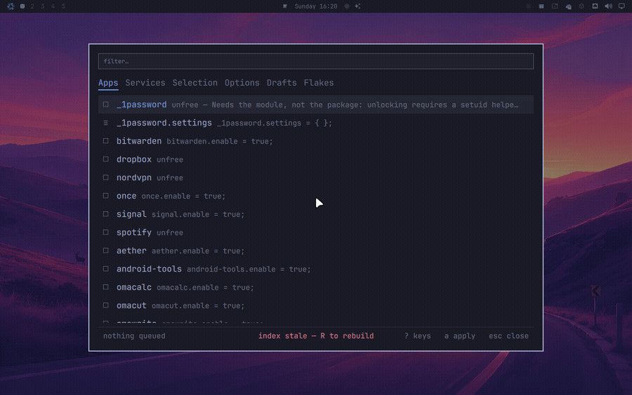
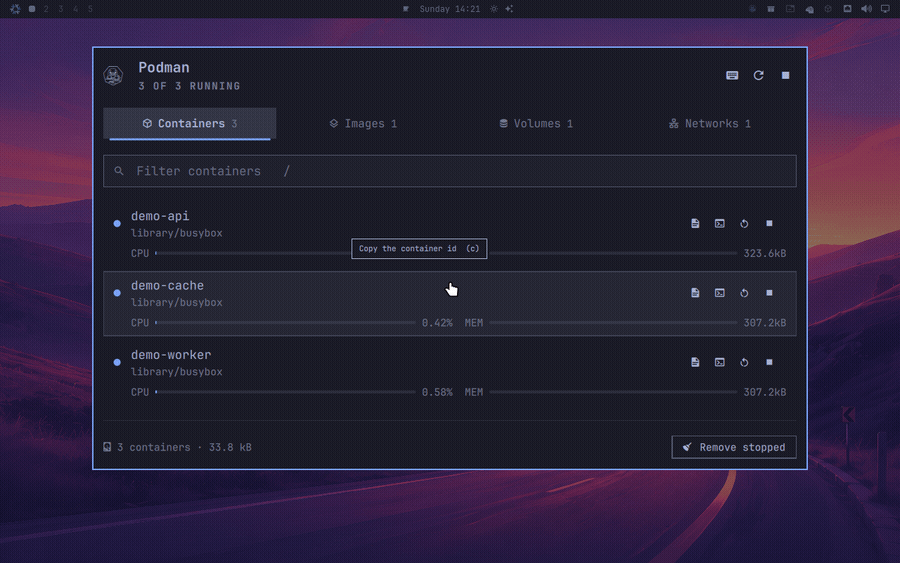
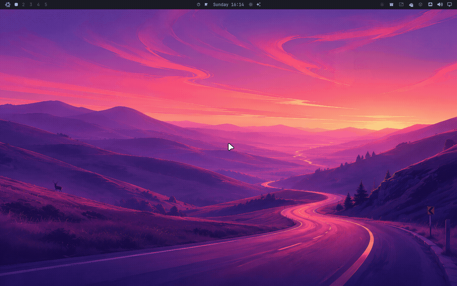
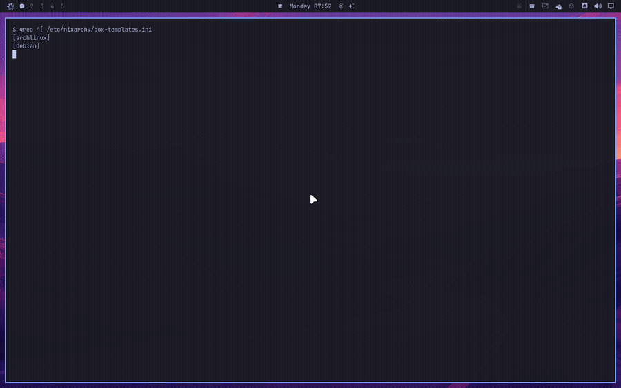
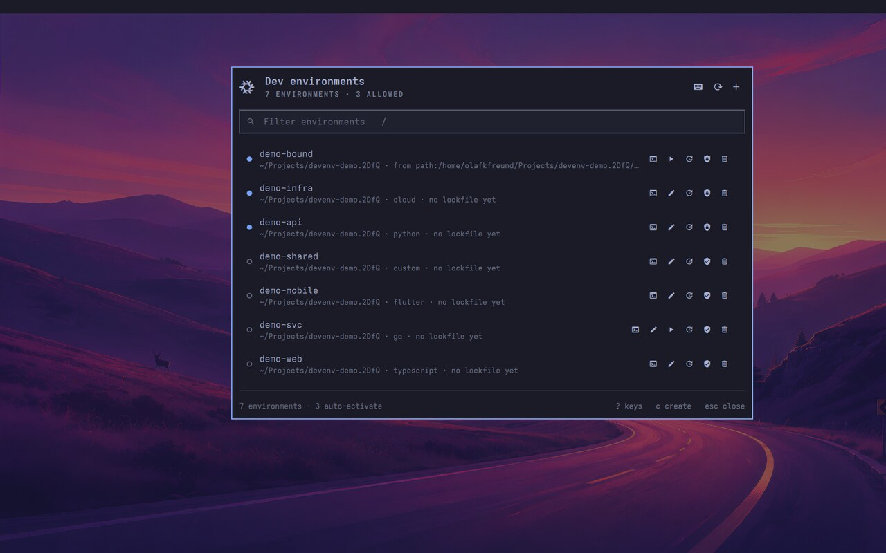

# nixarchy's plugins

Omarchy's desktop is a Quickshell shell, and a shell plugin is a panel, a bar
widget or a menu that lives inside it. Most of what nixarchy adds to Omarchy is
a NixOS answer to an Arch habit, and for a while each answer was a floating
terminal: an `fzf` picker for packages, `distrobox` commands for boxes,
`nixarchy vm` for sandboxes. These plugins put those jobs back where the rest of
the desktop already is: a chord and a list, keyboard-first, in the shell's own
look.

Some are **on by default**: installed with nixarchy and turned on at your first
login. Others are on their way, and one stays **opt-in** on purpose. Each entry
below says which. Turning one on happens *once*, so a plugin you switch off in
**Setup → Plugins** stays off. [Configuring nixarchy](configuration#nixarchys-own-plugins)
covers how to stop nixarchy installing one at all.

The keys below (Super+Alt+…) are seeded into `~/.config/hypr/bindings.lua` on
**new** installs. nixarchy never edits that file afterwards, so on an existing
machine use the menu row, or copy the line from a fresh install.

| Plugin | What it's for | Status | Open it |
|---|---|---|---|
| [Package manager](#package-manager) | apps, services, packages and options | **on by default** | Install ▸ Packages · Super+Alt+N <!-- nixarchy.pkg --> |
| [Podman](#podman) | containers, images, volumes, networks | **on wherever podman is** | Apps ▸ Podman · Super+Alt+O <!-- nixarchy.podman --> |
| [GitLab pipelines](#gitlab-pipelines) | CI for every project you belong to | **on by default** | Apps ▸ GitLab Pipelines · Super+Alt+P <!-- olafkfreund.gitlab-pipelines --> |
| [Herdr sessions](#herdr-sessions) | your herdr sessions and their agents | **on by default** | bar (right) · Apps ▸ Herdr · Super+Alt+H <!-- nixarchy.herdr --> |
| [MicroVMs](#microvms) | disposable and permanent VMs, one list | **on by default** | Trigger ▸ Sandbox · Super+Alt+V <!-- nixarchy.microvm --> |
| [Distrobox](#distrobox) | boxes, created from nixarchy's templates | **on wherever Boxes are** | Trigger ▸ Boxes · Super+Alt+D <!-- nixarchy.distrobox --> |
| [Dev environments](#dev-environments) | the per-project environments on this machine | **on wherever devenv is** | Apps ▸ Dev environments · Super+Alt+E <!-- nixarchy.devenv --> |
| [GitHub Actions](#github-actions) | workflow runs, jobs and steps | **on by default** | Apps ▸ GitHub Actions · Super+Alt+A <!-- olafkfreund.github-actions --> |
| [ai-mirror](#ai-mirror) | let an agent use your real desktop, and stop it | **on by default** | bar (right) · Super+Shift+Escape stops it <!-- olafkfreund.ai-mirror --> |
| [Voice](#voice) | operate the desktop by talking to it | **opt-in**, coming | — |

## Package manager

[nixarchy-pkg](https://github.com/olafkfreund/nixarchy-pkg) · [its own site](https://olafkfreund.github.io/nixarchy-pkg/)

**What it solves.** On NixOS you don't `pacman -S` a package; it goes into your
configuration and a rebuild builds it. Before this panel, that meant a floating
terminal and an `fzf` picker, or opening `~/.config/nixarchy/apps.nix` and
finding the right commented-out line. Every other surface on the desktop is a
chord and a list, and now so is this.

**What it does.** Search nixpkgs, turn curated apps and services on, add any
package, and set NixOS options through a form. Everything is written to the
same files nixarchy's own commands write, then applied with one key. The
rebuild asks for your password through the Omarchy dialog.

## Podman

[nixarchy-podman](https://github.com/olafkfreund/nixarchy-podman) · [its own site](https://olafkfreund.github.io/nixarchy-podman/)

**What it solves.** Looking after rootless containers otherwise means a
terminal, `podman ps`, and remembering the flags. This keeps the everyday work
on the keyboard, without opening a shell.

**What it does.** Containers, images, volumes and networks on four tabs.
Start, stop and restart; follow logs; open a shell in a container; remove and
prune, with a confirmation. The bar glyph shows when something needs
attention.

**When it's there.** It follows podman, not nixarchy. It comes on with the
**podman** row in the Services catalogue, or with [Boxes](boxes), and is absent
where podman is off. nixarchy's container engine is still rootless Docker, so
`docker` keeps meaning Docker.

## GitLab pipelines

[nixarchy-gltui](https://github.com/olafkfreund/nixarchy-gltui)

**What it solves.** Checking CI across many projects means a browser tab per
project. This is one popup: every project you are a member of, nested groups
included, with running pipelines first.

**What it does.** Projects → pipelines → stages → jobs, with no buttons, no
background daemon and no stored token. It uses `glab`, which nixarchy installs
with it. Run `glab auth login` once; until you do, the panel says so and stops
polling.

*Not shown moving: until `glab` is authenticated the panel is one unchanging "authenticate first" message, which cannot honestly clear the recorder's frame-diversity gate.*

## Herdr sessions

[nixarchy-herdr](https://github.com/olafkfreund/nixarchy-herdr)

**What it solves.** Coding agents run inside [herdr](https://github.com/ogulcancelik/herdr)
sessions, and without this you find out that one is waiting for you only by
switching to its terminal. The bar tells you instead.

**What it does.** Your herdr sessions and the agents inside them, across
machines, not just this one. You see who is working, who is done, and who
**needs you**. Open a session, start a new one, or send an agent a prompt from
the popup. `herdr` itself comes with it from nixpkgs, so update it through
nixpkgs (`herdr update` cannot write to the Nix store), or put your own build
ahead of it on `PATH`.

## MicroVMs

[nixarchy-microvm](https://github.com/olafkfreund/nixarchy-microvm) · [its own site](https://olafkfreund.github.io/nixarchy-microvm/)

**What it solves.** nixarchy has two kinds of VM: disposable [sandboxes](sandboxes)
from `nixarchy vm`, and permanent machines you declare in your configuration.
They lived in two places. This puts both in one list.

**What it does.** Create a VM from a template, run it in the background and
attach to its console later, stop it, or remove it. There's optional help from
your AI agent to fill in the create form. It is **Trigger ▸ Sandbox** now,
and `nixarchy vm` is still there in a terminal.

## Distrobox

[nixarchy-distrobox](https://github.com/olafkfreund/nixarchy-distrobox) · [its own site](https://olafkfreund.github.io/nixarchy-distrobox/)

**What it solves.** [Boxes](boxes) are for software NixOS will not run, and
looking after them meant remembering `distrobox` subcommands. A multi-minute
image pull or upgrade also tied up a terminal.

**What it does.** Every box with its image and home directory. Enter one in a
terminal; start, stop, restart, upgrade or delete it. Create a box from a form,
and watch create and upgrade stream into the panel. It is **Trigger ▸ Boxes**
wherever [Boxes](boxes) are on, and its templates are nixarchy's own, from
`/etc/nixarchy/box-templates.ini`.

## Dev environments

[nixarchy-devenv](https://github.com/olafkfreund/nixarchy-devenv) · [its own site](https://olafkfreund.github.io/nixarchy-devenv/)

**What it solves.** [Per-project environments](per-project-environments) were a
command and nothing else: `nixarchy dev init` scaffolded a project, and after
that every environment on the machine was invisible. Which folders have one,
which activate on `cd`, which have a database running — all of it lived in
your head or in `ls`.

**What it does.** Every devenv project under your project roots, the ones you
allowed first. Directories bound to a configuration elsewhere with `devenv
--from` are listed too, reading **from &lt;source&gt;**; they have nothing of
their own to edit or delete, so removal offers only revoke. Enter one in a terminal (`devenv shell`), edit its `devenv.nix`,
start and stop its processes, update its lock, allow or revoke it, and remove
it in steps from revoke to deleting the folder. Create a new project from
seventeen templates — languages, Jupyter and machine learning, Flutter, Android, and cloud
projects for AWS, Azure, GCP and five more. It is **Apps ▸ Dev environments**
or **Super+Alt+E** wherever the [devenv service](per-project-environments) is
on, and `nixarchy dev …` is the same tool in a terminal.

## GitHub Actions

[nixarchy-ghtui](https://github.com/olafkfreund/nixarchy-ghtui)

**What it solves.** The same as [GitLab pipelines](#gitlab-pipelines), for
GitHub: CI across your repositories without a browser tab for each.

**What it does.** Repositories → workflow runs → jobs → steps, with running
workflows first, through `gh`, which nixarchy installs with it. Run
`gh auth login` once; until you do, the panel says so and stops polling. Its
keys are on **Super+Ctrl+Alt+A**.

**If you installed it by hand before,** remove your copy before switching:
`rm -rf ~/.config/omarchy/plugins/olafkfreund.github-actions`. nixarchy won't
replace a real directory. It stays enabled, and the managed copy takes over.

*Not shown moving, for the same reason as GitLab pipelines above: unauthenticated, the panel holds one message still.*

## ai-mirror

[ai-mirror](https://github.com/olafkfreund/ai-mirror) · **on by default**

**What it solves.** A coding agent can drive a browser or a terminal, but not
the dialog, the drag or the unlabelled button on your real desktop. ai-mirror
gives an agent eyes and hands on your actual session, and takes them back
with one keypress.

**What it does.** A small MCP server and a mark in the bar (right). It is
installed on every nixarchy machine, and **no agent is connected to it** until
you set `programs.nixarchy.aiMirror.mcp = true;`. Turning that off again takes
the connection back out of Claude Code, Codex and opencode.

**The mark says what an agent is doing.**

| the mark | means |
|---|---|
| dim | nothing: agent control is off |
| the theme's accent colour, steady | an agent is **watching**: reading the screen, the clipboard or the accessibility tree. It cannot type or click. |
| red, pulsing | an agent **controls** the keyboard and mouse |

**An agent asks, and you answer.** When an agent wants control, a dialog asks
you on screen. Nothing is granted until you press yes, and an unanswered
request lapses after 30 seconds. **Super+Shift+Escape**, or a click on the
mark, takes control back at any moment. A grant also ends by itself after ten
minutes with no input, and when the agent that asked goes away.

**What the yes does not cover.** An agent that reaches ai-mirror through the
connection above cannot answer its own request. **An agent with a shell on your
account can.** It can run `ai-mirror control confirm` itself, and no prompt
inside your session can stop that. This is a deliberate choice, not an
oversight: the agent already runs as you. Run an agent you do not trust in a
[sandbox or a MicroVM](sandboxes) instead, where your desktop is not in reach.
Every grant is logged with who asked, so a self-grant shows up afterwards.

If you have turned the mark off and your `bindings.lua` predates the kill
switch, a grant made that way has nothing on screen to stop it. It still ends
after ten idle minutes, and `ai-mirror control off` in any terminal ends it at
once.

**[Watch the nixarchy desktop showcase](https://github.com/olafkfreund/ai-mirror/releases/download/demo-2026-09-18/nixarchy-desktop-showcase.mp4)**, recorded by an agent through ai-mirror.

*Not recorded yet. It needs an agent driving the desktop, which is [#816](https://github.com/olafkfreund/nixarchy/issues/816) pass C.*

## Voice

[nixarchy-voice](https://github.com/olafkfreund/nixarchy-voice) · [its own site](https://olafkfreund.github.io/nixarchy-voice/)
· **opt-in, coming**

**What it solves.** Operating the desktop by talking to it. It turns voice into
actions, not only text; [dictation](ai) (Voxtype) stays for typing.

**What it does.** A wake word or toggle key is heard locally, whisper.cpp
transcribes it on your CPU, a model you have signed in to answers, and a local
voice speaks the reply.

**Why it's opt-in.** It needs a model account, it sends what you ask about
(including screen and clipboard content) to that model, and it is about 1 GiB
with its speech models. So it is not in the default install. A **Set up voice**
menu row installs it and asks which backend to use. Notification logging, the
wake word and desktop control all start off.

*Not recorded yet. Speech is the one thing a silent GIF cannot show; pass C decides what it can show instead.*
