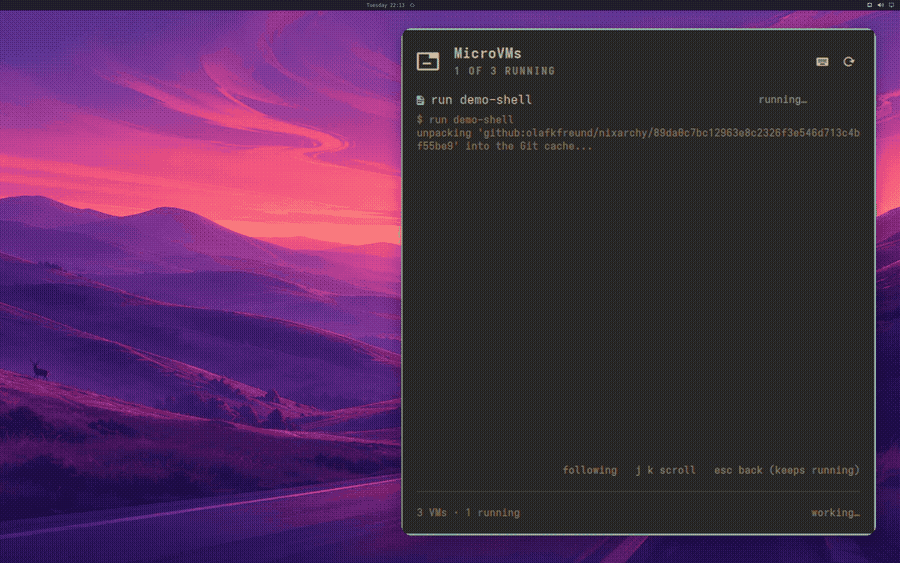

# Sandboxes

`nixarchy vm create shell-1` and, seconds later, `nixarchy vm run shell-1`
puts you at a prompt inside a fresh NixOS — no root, no `nixos-rebuild`, and
nothing left on the machine when you `nixarchy vm rm` it. Try a package set
you do not trust, run a build that wants root, check whether a config
actually boots, reproduce someone's bug report: today, off this feature,
each of those either happens on your real machine or does not happen.

It is [microvm.nix](https://github.com/microvm-nix/microvm.nix) underneath,
booted with your host's `/nix/store` mounted read-only over 9p rather than
copied into a disk image — a sandbox costs megabytes, not gigabytes, and the
packages inside it are the same store paths as the ones outside it.



## What it is not

**Not a desktop VM.** Headless, no display. If you want a GUI machine with a
window and a disk you manage, [virt-manager](other-packages) from the
catalogue is the tool for that — this is a console, and the console is the
whole interface.

**Not a container.** A sandbox boots its own kernel, which is slower to
start than `podman run` and is the entire point: a kernel parameter, a boot
sequence, a module that wants `CAP_SYS_ADMIN` — none of that is answerable
inside a container, on this machine or anywhere else.

**Not a security boundary you should design a threat model around.** The
shared folder is your own home directory's worth of state — a per-VM
directory under it, but the guest can write everything under `/mnt/host` —
and KVM escapes exist. Isolation from a package you do not trust yet; not
isolation from an attacker who already has a foothold in the guest.

**Not nixarchy's own test VM.** `nix run .#vm` boots the desktop itself, to
test *this repository*. A sandbox is a machine for you, running whatever
template you picked, and the two share nothing but qemu.

## Turning it on

`nixarchy vm` is a command, not a service — it is installed on every
nixarchy machine, the same as `nixarchy dev init`, so there is nothing to
enable for the disposable half above. What you are turning on by using it is
whatever templates you pick, one machine at a time, and nothing runs until
you do.

The **menu group** is the one thing that needs a moment: `Trigger ▸ Sandbox`
is generated into the merged menu defaults at rebuild time, and Omarchy's
shell reads that file once, at login. Rebuilding with this feature already
on your system does not make the row appear in an already-open session —
log out and back in, or `omarchy menu summon vm` from a terminal to skip the
mouse. Search also finds it by alias: type "vm", "sandbox" or "microvm" from
the root of the menu.

## The templates

`nixarchy vm templates` lists these from the running system; the table below
is the same catalogue, `data/microvm-templates.nix`.

| template | what it adds | note |
|---|---|---|
| `shell` | nothing beyond the base guest | the fastest way to a throwaway prompt, and the template every other one starts from |
| `python` | `python3`, `uv`, 3 GiB RAM | ephemeral — `uv venv /mnt/host/.venv` if the venv should outlive the VM |
| `podman` | rootless-capable podman, Docker-compatible | `/var/lib/containers` is a 20 GiB volume that survives a restart; the rest of the root filesystem does not |
| `agent` | `shell` plus git, curl, and an egress allowlist | nothing in the guest reaches the network except through a local proxy that only permits hosts you name — see [Running an agent that cannot phone home](#running-an-agent-that-cannot-phone-home) |
| `persistent` | `shell` plus `/home` on its own volume | the volume goes when the VM does; the root filesystem is still thrown away every boot |

Every template is a plain NixOS module — nothing here invents nixarchy
vocabulary. If you outgrow one, copy `module` out of the catalogue entry
into a flake of your own and grow it from the NixOS manual and microvm.nix's
own options reference from there.

## What is inside

Every guest, regardless of template, gets the same four things from
`modules/microvm/guest.nix`:

- **A `dev` user**, autologin on the serial console, in `wheel`, with no
  password — there is no other way in (no SSH, no host network surgery), so
  a password would gain nothing.
- **The host's `/nix/store`**, read-only, mounted over 9p. This is the whole
  reason a sandbox is cheap: no disk image is ever built for it.
- **The network is NAT out, nothing in.** User-mode (SLiRP) networking:
  `curl`, `git clone`, a package fetch all work; nothing on the host, and
  nothing on your LAN, can reach in. No bridge, no tap device, no firewall
  rule to write. The `agent` template is the one that restricts the *outbound*
  half of this.
- **A root filesystem on tmpfs.** Gone at every boot, along with anything
  you installed imperatively with `nix-env` or wrote outside a path a
  template explicitly persists. `shell` and `python` persist nothing at
  all; `podman` persists `/var/lib/containers`; `persistent` persists
  `/home`.

## Running an agent that cannot phone home

The `agent` template exists for one job: running an AI coding agent — or any
program you are willing to let loose on a checkout but not on your network —
where the filesystem boundary is not the only boundary.

The filesystem half is the same one every template gets, and it is the strong
half: the guest sees your host `/nix/store` read-only and one directory at
`/mnt/host`, and nothing else. That is worth saying plainly, because the
common alternatives are weaker. A bubblewrap wrapper maps *your* user into
the sandbox, so a process that gets out of it reads `~/.ssh` and every API
key on the machine. A guest kernel does not have that shape.

What `agent` adds is the network. Every other template inherits "NAT out,
nothing in", which is no constraint at all on a process you are running
*because* you do not fully trust it. Here, the guest's own firewall drops
everything outbound except the local proxy's traffic, and the proxy refuses
any host you did not name.

You name them one per line, in the VM's own directory, before you start it:

```sh
nixarchy vm create review-bot --template agent
cat > ~/.local/state/nixarchy/microvm/review-bot/allow-hosts <<'EOF'
api.anthropic.com
github.com
EOF
nixarchy vm run review-bot
```

Subdomains of a listed host are allowed (`github.com` covers
`api.github.com`), nothing else is, and `#` starts a comment. Inside the
guest, `http_proxy` and `https_proxy` are already set, so `curl`, `git`,
`pip`, `uv`, `npm` and every model SDK route through the proxy without being
told.

**No file, or an empty one, means nothing is allowed.** That is the only safe
way for this to fail, and it is the failure you will meet first: an agent
that reports it cannot reach its own API is telling you the allowlist is not
where it expected.

### What this does and does not contain

It **does** stop a process in the guest from reaching anything but the hosts
you listed. Not by asking it politely — there is no socket to the outside
world for any user but the proxy's, DNS included, so an agent cannot resolve
a name, let alone open a connection. DNS tunnelling is off the table for the
same reason.

It **does not**:

- **Stop data leaving through an allowed host.** You allowed your model
  endpoint; everything you hand the agent goes there. That channel is the
  point of the exercise, and an allowlist cannot tell a prompt from an
  exfiltration.
- **Work for `ssh://` git remotes.** The proxy speaks HTTP `CONNECT` and is
  restricted to port 443. Use an `https://` remote and a token.
- **Verify what is on the other end of an allowed name.** The allowlist
  matches the hostname the client asks for; TLS is end to end, so nothing
  here inspects or re-signs it. That is the right trade — a sandbox that
  terminated your TLS would be a sandbox that could read your model traffic.
- **Survive root inside the guest.** A process that becomes root there can
  flush the ruleset. It still cannot leave the VM, which is the boundary that
  matters, but treat the allowlist as a policy for an agent doing what agents
  do, not as a cage for an attacker.
- **Restrict the shared directory.** `/mnt/host` is read-write, as it is for
  every template. Put the checkout there and nothing else.

### And when it does get out and break something

Worth saying once, because nobody markets it and it is free: on a NixOS
machine an agent's damage to the *system* is undone by

```sh
sudo nixos-rebuild --rollback switch
```

or by picking the previous generation in the boot menu. Whatever it added,
removed or reconfigured through the system's own configuration is gone, in
one command, atomically. That is not a sandbox — it does not touch your home
directory, your git working tree, or anything installed imperatively — but it
is the reason "let an agent edit my configuration" is a much smaller bet here
than on a distribution where it is not reversible.

## Getting back in, stopping, destroying

```sh
nixarchy vm list                  # what you have, and which are running
nixarchy vm run shell-1           # attach again — Ctrl-A X leaves the
                                   # console without stopping the VM
nixarchy vm stop shell-1          # ask it to shut down
nixarchy vm rm shell-1            # delete it and its state
```

A second `run` of a name that is already attached refuses rather than racing
a second qemu over the same shared directory — you get "already running",
not a wedged guest.

## On-disk layout, and the GC root

Everything a VM has lives at
`~/.local/state/nixarchy/microvm/<name>/`: the template it was created from,
its runtime hostname, and — after the first `run` — `current`, a symlink
into the store that is also this VM's garbage-collection root. `nix build
--out-link` is what writes it, deliberately never `nix run`, which registers
no root at all: a `nix-collect-garbage` while a guest is running would take
the store it is 9p-mounted on out from under it.

The consequence worth knowing: a template dropped from a later release of
this flake keeps running here, for any VM that already built its `current`
link, until you `rm` that VM's directory. There is no separate cleanup step
and no image left behind once you do — `rm -rf` on the directory is the
entire teardown, root included.

## The declarative half

Everything above is the machine you create and destroy on a whim. For one
you want to *keep* — up at every boot, without you starting it —
`programs.nixarchy.services.microvm` is the other half of this feature,
off by default:

```nix
programs.nixarchy.services.microvm = {
  enable = true;
  machines.build-box = {
    template = "podman";
    memory = 4096;
    cores = 2;
    sshPort = 2222;
  };
};
```

A declarative machine gets a forwarded SSH port compiled into its own
closure — the one door the disposable half deliberately does not have,
since every disposable VM of a template shares one closure and so cannot
each carry a different port. State lives under `/var/lib/microvms/<name>`,
root's to manage, and the machine comes up under systemd the moment you
rebuild. Turning this on for the first time also grants the `kvm` group to
`programs.nixarchy.user` (or whoever `programs.nixarchy.services.microvm.user`
names) and switches on `microvm.host.enable` upstream — both stay off, and
nothing about a machine you have not declared runs, until `machines` is
non-empty.

See also: [Per-project environments](per-project-environments) for the
other "an environment vs. a machine" tool on this desktop — devenv answers
"I want this directory's toolchain," a sandbox answers "I want a machine."
