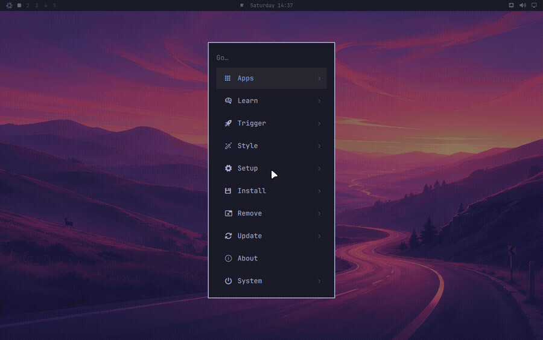

# Updates

_Update > Nixarchy_ in the Omarchy menu (`Super + Space`) — upstream labels it
_Update > Omarchy_ — is still the one place to keep everything current. The
row runs `omarchy update`, and this page is about what that means on NixOS and
what happened to the rest of upstream's update machinery. The mechanics —
`nix flake update`, the four rebuild modes, generations, rollback and the
stale-session trap — are on [Updating NixOS](updating-nixos.md), and are not
repeated here.



## What an update is

On Arch an update installs a new `omarchy` package, runs its migrations, and
upgrades every system package from the Omarchy mirror. Those are three
different mechanisms.

Here they are one. Omarchy, nixpkgs and nixarchy are all inputs to your flake,
and `flake.lock` pins each of them to an exact revision. `omarchy update`
moves every pin forward and rebuilds:

```sh
nh os switch --update <flake>
```

That is one command for both halves. `nh` is a front end to the same
nixos-rebuild machinery, so the result is identical -- what it adds is a live
view of what is building and a diff of the packages that actually changed,
which on an update is the only question worth asking.

It asks first. A new Omarchy release arrives as a source bump of the `omarchy`
input, so the menus, themes and commands come along with it. Your app
selection is not touched: it lives in a file you own.

Nothing is snapshotted before the update because the previous system is still
on disk as a generation; see [rolling back](#rolling-back-bad-updates).

The update-available icon next to the clock is upstream's, and it is driven by
`omarchy-update-available`, which has been replaced to fit this model.

## Channels: two of upstream's four mean something here

Upstream has four — stable, RC, edge, dev. Two of them have a NixOS meaning
and two do not, so _Update ▸ Channel_ offers exactly the two:

| upstream | here |
|---|---|
| stable | `nixos-26.05`, and the matching home-manager |
| edge | `nixos-unstable`, what nixarchy is developed against |
| RC, dev | hidden — pacman repositories with no NixOS equivalent |

`rc` and `dev` are left out rather than given an invented meaning: a row that
does something other than what its name says is the failure this menu guards
against hardest.

The rows run `nixarchy channel`, which edits your `flake.nix` under the rule
`nixarchy-unfreeze` set — only lines this project wrote get rewritten, and a
flake you have reshaped is yours, so the edit is printed for you to make
instead of guessed at. nixpkgs and home-manager always move together, because
neither project supports the mismatch.

**"Stable" sounds safer and here it is less tested** — nixarchy is developed
against unstable, and what CI proves about stable is a twenty-second
evaluation, not a booted machine. That trade-off, the per-package escape from
one channel to the other, and what switching costs you in rebuild time are all
in **[stable or unstable](channels)**.

`omarchy-channel-set` and `omarchy-channel-current` are still carried
unchanged and are still unreachable: the UI entry points they served are
replaced by `pkgs/omarchy/nix-bin`.

## Firmware updates

_Update > Firmware_ runs `omarchy-update-firmware`, which is upstream's
script unchanged: it calls `fwupdmgr refresh --force` and `sudo fwupdmgr
update`. Its first step is to install `fwupd` if `fwupdmgr` is missing, which
goes through `omarchy-pkg-add` and therefore stops. Enable the service in
your configuration once and the row works from then on:

```nix
services.fwupd.enable = true;
```

Plenty of firmware can only be written during a reboot, so expect to be asked
for one. The step that copies an EFI binary into `/boot/EFI/arch/` looks for
an Arch path that does not exist here and is skipped.

## Direct updates, and why there is no guard

Upstream stops a bare `pacman -Syu` because it would skip the snapshot and the
migrations. Here there is nothing to guard: `nix flake update` followed by
`nixos-rebuild switch` **is** the update, and running those two commands
yourself is exactly what `omarchy update` does. The only thing you lose by
running them by hand is the confirmation prompt.

The more useful distinction is between updating everything and updating one
input. `omarchy update` moves all of them;
`nix flake update nixpkgs --flake <flake>` moves one. When you are chasing a
specific fix, the second is the
better habit — see [Updating NixOS](updating-nixos.md#the-long-way-and-when-you-want-it).

## Machines that update themselves

A machine can pull its configuration from a git repository on a timer instead
of waiting to be told:

```nix
programs.nixarchy.fleet = {
  enable = true;
  url = "github:you/config";
};
```

Off unless you turn it on, and worth understanding before you do: the running
system then comes from the **remote** flake, so local edits under `/etc/nixos`
that were never pushed are reverted at the next pull. See
[many machines, one repo](many-machines).

## Rolling back bad updates

The snapshot upstream restores from the boot menu is a generation here, and
you have one for every rebuild you have ever done, not just the last update.

```sh
sudo nixos-rebuild --rollback switch
```

or pick the previous entry in the boot menu. To see what an update actually
changed, before deciding whether to roll it back:

```sh
nix profile diff-closures --profile /nix/var/nix/profiles/system
```

`nix-collect-garbage -d` deletes old generations. It is how you get disk
space back, and it is also the only command that removes your rollback path,
so run it after an update has proved itself, not before.

## `omarchy reinstall` is not a recovery route

Upstream's answer to corrupted configuration is `omarchy reinstall`, which
reinstalls the packages, downgrades to stable and resets every config file.
The command exists here but cannot complete: its first act is `pacman -Suu`,
the shim refuses, and `set -e` aborts before any configuration is touched.
That is the right outcome — half of a reinstall would be worse than none —
but it means the command does nothing.

What replaces it depends on what broke:

| Symptom | Do this |
|---|---|
| A rebuild left the desktop broken | Roll back the generation |
| One app's config is wrong | `omarchy refresh <app>` restores that app's defaults |
| `~/.config/hypr` or another Omarchy config is mangled | `omarchy refresh` for it, or `git checkout` if you keep `~/.config` in git |

Nothing under `$OMARCHY_PATH` can be corrupted by you, because it is a
read-only store path. If a file there is wrong, it was wrong in the release,
and the fix is a bump of the `omarchy` or `nixarchy` input.
